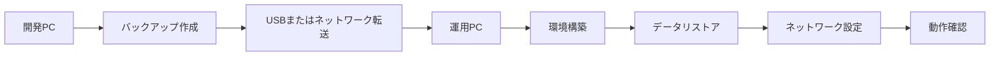

# アゲアゲくん 環境移行ガイド

## 概要
このドキュメントは、アゲアゲくんシステムを開発環境から運用環境に移行し、ローカルネットワーク内の複数PCから利用可能にするための完全ガイドです。

## システム現状（2025年1月時点）

### データベース情報
- **PostgreSQL バージョン**: 17
- **データベース名**: ageagekun
- **データベースサイズ**: 約8.7 MB
- **レコード数**:
  - patients: 7件
  - documents: 17件
  - rpa_queue: 18件
  - batch_prints: 4件

### ファイルシステム
- **patients フォルダ**: 約3.6 MB
- **batch_prints フォルダ**: 未作成（データベースレコードのみ存在）

### 環境設定
- **Node.js サーバー**: ポート3000
- **PostgreSQL**: ポート5432
- **Azure OpenAI API**: 設定済み（Sweden Central リージョン）

## 移行フロー



## Phase 1: 開発環境でのバックアップ作業

### 1.1 自動バックアップスクリプトの実行

PowerShellを管理者権限で起動し、以下のスクリプトを実行：

```powershell
# backup_dev.ps1 を実行
.\backup_dev.ps1
```

このスクリプトは以下を自動実行：
- PostgreSQLデータベースのダンプ作成
- patientsフォルダのコピー
- 環境設定ファイルのエクスポート
- タイムスタンプ付きバックアップフォルダの作成

### 1.2 手動バックアップ手順（スクリプトが使えない場合）

#### データベースバックアップ
```powershell
# データベースをダンプ
$timestamp = Get-Date -Format "yyyyMMdd_HHmmss"
"C:\Program Files\PostgreSQL\17\bin\pg_dump.exe" -U postgres -h localhost -d ageagekun -F c -b -v -f "ageagekun_$timestamp.dump"
```

#### ファイルバックアップ
```powershell
# patientsフォルダをコピー
$backupDir = "backup_$(Get-Date -Format 'yyyyMMdd')"
New-Item -ItemType Directory -Path $backupDir -Force
Copy-Item -Path "C:\Users\hyosh\Desktop\allright\ageagekun\patients" -Destination "$backupDir\patients" -Recurse
```

### 1.3 確認すべき設定値

以下の情報を必ずメモまたはコピーしてください：

#### データベース接続情報
- **パスワード**: `C:\Users\hyosh\AppData\Roaming\postgresql\pgpass.conf` から確認
- 形式: `localhost:5432:*:postgres:YOUR_PASSWORD`

#### Azure OpenAI設定（.env.localから）
```
AI_PROVIDER=azure
AZURE_OPENAI_API_KEY=[要確認]
AZURE_OPENAI_ENDPOINT=[要確認]
AZURE_OPENAI_DEPLOYMENT_NAME=gpt-4o-mini
AZURE_OPENAI_API_VERSION=2024-10-21
```

#### GitHubリポジトリ
- リポジトリURL（プライベートリポジトリの場合はアクセストークンも必要）

## Phase 2: 運用環境の準備

### 2.1 必要なソフトウェアのインストール

#### PostgreSQL 17
1. [PostgreSQL公式サイト](https://www.postgresql.org/download/windows/)からインストーラーをダウンロード
2. インストール時のパスワードは開発環境と同じものを推奨
3. pgAdmin 4も同時にインストール（GUI管理用）

#### Node.js（LTS版推奨）
1. [Node.js公式サイト](https://nodejs.org/)からLTS版をダウンロード
2. インストール後、コマンドプロンプトで確認：
```bash
node --version
npm --version
```

#### Git
1. [Git for Windows](https://git-scm.com/download/win)をインストール
2. GitHubアクセス用の認証設定

### 2.2 ソースコードの取得

```bash
# 適切なディレクトリに移動
cd C:\Users\[ユーザー名]\Desktop

# GitHubからクローン
git clone [リポジトリURL] allright
cd allright\ageagekun
```

### 2.3 Node.js依存関係のインストール

```bash
cd backend
npm install
```

## Phase 3: データのリストア

### 3.1 データベースの作成とリストア

#### 自動リストアスクリプト
```powershell
# restore_production.ps1 を実行
.\restore_production.ps1 -BackupFile "path\to\ageagekun.dump"
```

#### 手動リストア手順
```powershell
# 1. データベース作成
"C:\Program Files\PostgreSQL\17\bin\psql.exe" -U postgres -h localhost -w -c "CREATE DATABASE ageagekun;"

# 2. データリストア
"C:\Program Files\PostgreSQL\17\bin\pg_restore.exe" -U postgres -h localhost -d ageagekun -v "path\to\ageagekun.dump"

# 3. 確認
"C:\Program Files\PostgreSQL\17\bin\psql.exe" -U postgres -h localhost -d ageagekun -w -c "\dt"
```

### 3.2 ファイルシステムの復元

```powershell
# patientsフォルダを復元
Copy-Item -Path "バックアップ\patients" -Destination "C:\Users\[ユーザー名]\Desktop\allright\ageagekun\patients" -Recurse
```

### 3.3 パス整合性の修正

Documentsテーブルのパスがユーザー名に依存している場合：

```sql
-- PostgreSQLで実行
UPDATE documents
SET base_dir = REPLACE(base_dir, 'hyosh', '新ユーザー名')
WHERE base_dir LIKE '%hyosh%';
```

## Phase 4: ネットワーク設定

### 4.1 運用PCのIPアドレス固定

#### Windows設定から
1. 設定 → ネットワークとインターネット → イーサネット/Wi-Fi
2. IP設定 → 編集 → 手動
3. IPv4を有効化：
   - IPアドレス: 192.168.0.10（例）
   - サブネットマスク: 255.255.255.0
   - ゲートウェイ: 192.168.0.1
   - DNS: 192.168.0.1

### 4.2 PostgreSQL設定

#### postgresql.conf 編集
場所: `C:\Program Files\PostgreSQL\17\data\postgresql.conf`

```conf
# 変更
listen_addresses = '*'  # または '192.168.0.10'
```

#### pg_hba.conf 編集
場所: `C:\Program Files\PostgreSQL\17\data\pg_hba.conf`

追加：
```conf
# ローカルネットワークからの接続許可
host    ageagekun    all    192.168.0.0/24    scram-sha-256
```

#### サービス再起動
```powershell
Restart-Service -Name "postgresql-x64-17"
```

### 4.3 Node.jsサーバー設定

#### backend/server.js 修正
```javascript
// 変更前
server.listen(PORT, async () => {

// 変更後
server.listen(PORT, '0.0.0.0', async () => {
```

#### backend/.env 作成
```env
# Database
DB_HOST=localhost
DB_PORT=5432
DB_NAME=ageagekun
DB_USER=postgres
DB_PASSWORD=rad1ohead

# Server
PORT=3000
NODE_ENV=production
HOST=0.0.0.0

# CORS（実際のIPアドレスに置き換え）
CORS_ORIGIN=http://192.168.0.10:3000

# Azure OpenAI（開発環境からコピー）
AI_PROVIDER=azure
AZURE_OPENAI_API_KEY=[APIキー]
AZURE_OPENAI_ENDPOINT=[エンドポイント]
AZURE_OPENAI_DEPLOYMENT_NAME=gpt-4o-mini
AZURE_OPENAI_API_VERSION=2024-10-21
```

### 4.4 Windowsファイアウォール設定

#### 自動設定スクリプト
```powershell
# network_setup.ps1 を管理者権限で実行
.\network_setup.ps1
```

#### 手動設定
```powershell
# PostgreSQL ポート開放
New-NetFirewallRule -DisplayName "PostgreSQL (ageagekun)" `
  -Direction Inbound -Protocol TCP -LocalPort 5432 `
  -Action Allow -Profile Private `
  -RemoteAddress 192.168.0.0/24

# Node.js ポート開放
New-NetFirewallRule -DisplayName "Node.js (ageagekun)" `
  -Direction Inbound -Protocol TCP -LocalPort 3000 `
  -Action Allow -Profile Private `
  -RemoteAddress 192.168.0.0/24
```

## Phase 5: 動作確認

### 5.1 サーバー起動

```bash
cd backend
npm start
```

正常起動時の表示：
```
╔════════════════════════════════════════╗
║     Ageagekun Backend Server          ║
╠════════════════════════════════════════╣
║  🚀 Server running on port 3000       ║
║  📍 http://localhost:3000             ║
║  🔧 Environment: production           ║
╚════════════════════════════════════════╝
🌐 WebSocket service activated
✅ PostgreSQL connected successfully
```

### 5.2 ローカルアクセステスト

ブラウザで以下にアクセス：
- `http://localhost:3000` - ローカル確認
- `http://localhost:3000/api/health` - API動作確認

### 5.3 ネットワークアクセステスト

別のPCから：
- `http://192.168.0.10:3000` - メイン画面
- `http://192.168.0.10:3000/api/health` - API確認

### 5.4 データベース接続テスト

```powershell
# ローカルから
"C:\Program Files\PostgreSQL\17\bin\psql.exe" -U postgres -h localhost -d ageagekun -w -c "SELECT COUNT(*) FROM patients;"

# ネットワーク経由（別PCから）
"C:\Program Files\PostgreSQL\17\bin\psql.exe" -U postgres -h 192.168.0.10 -d ageagekun -W -c "SELECT COUNT(*) FROM patients;"
```

## トラブルシューティング

### よくある問題と解決策

#### 1. PostgreSQL接続エラー
```
FATAL: no pg_hba.conf entry for host
```
**解決策**: pg_hba.confにクライアントPCのIPアドレス範囲を追加

#### 2. Node.jsがネットワークから見えない
```
ERR_CONNECTION_REFUSED
```
**解決策**:
- server.jsで`'0.0.0.0'`を指定しているか確認
- Windowsファイアウォールでポート3000が開いているか確認

#### 3. CORS エラー
```
Access to fetch at 'http://192.168.0.10:3000/api/...' from origin 'http://192.168.0.10:3001' has been blocked by CORS policy
```
**解決策**: backend/.envのCORS_ORIGINを適切に設定

#### 4. ファイルパスエラー
```
ENOENT: no such file or directory
```
**解決策**: Documentsテーブルのbase_dirを新しいユーザー名に更新

### ログファイルの場所
- PostgreSQL: `C:\Program Files\PostgreSQL\17\data\log\`
- Node.js: コンソール出力（PM2使用時は`~/.pm2/logs/`）

## セキュリティチェックリスト

- [ ] PostgreSQLパスワードは強固か
- [ ] Azure OpenAI APIキーは.envファイルのみに記載
- [ ] .envファイルはGitignoreに含まれているか
- [ ] ファイアウォールはローカルネットワークのみ許可
- [ ] 不要なポートは閉じているか
- [ ] 定期的なバックアップ設定はあるか
- [ ] Windowsの自動更新は有効か

## メンテナンス

### 定期バックアップ
タスクスケジューラで以下を毎日実行：
```powershell
"C:\Program Files\PostgreSQL\17\bin\pg_dump.exe" -U postgres -h localhost -d ageagekun -F c -b -f "D:\Backup\ageagekun_$(Get-Date -Format 'yyyyMMdd').dump"
```

### ログローテーション
PostgreSQLのログは自動ローテーション設定を推奨：
```conf
# postgresql.conf
log_rotation_age = 1d
log_rotation_size = 100MB
```

## 連絡先・サポート

問題が発生した場合：
1. このドキュメントのトラブルシューティングを確認
2. `logs/`フォルダのエラーログを確認
3. GitHubのIssuesに報告

---
最終更新: 2025年1月
作成者: Claude (Anthropic)