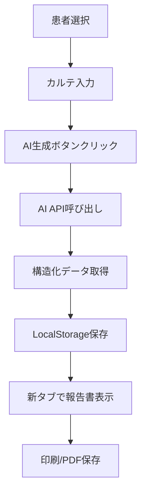

# 概要
これはアップロードくんの要件定義書です。

# 目的
PADと連動して、書類を電子カルテに自動アップロードするためのアプリ

# 仕様
    ## フロントエンド

    ## バックエンド
    - DB構造は /DBshcemaに記載。
        - Documentsのpassというカラムにはファイルの完全パスが記載されている
        - Documents.passカラムには完全なファイルパスが格納される
        - Documents.base_dirカラムにはファイルが存在するディレクトリパス（ファイル名を除いたパス）が格納される
        
    ### ファイル管理構造
    ```
    C:\Users\hyosh\Desktop\allright\ageagekun\patients\
    └── [patientID]\
        ├── ファイル1.pdf (未アップロード: isUploaded=false)
        ├── ファイル2.pdf (未アップロード: isUploaded=false)
        └── uploaded\
            ├── ファイル3.pdf (アップロード済み: isUploaded=true)
            └── ファイル4.pdf (アップロード済み: isUploaded=true)
    ```
    
    **ファイル配置ルール**：
    - すべてのファイルは患者IDディレクトリ（8桁ゼロパディング）内に配置
    - `isUploaded=false`: 患者IDディレクトリ直下
        - 例: `C:\Users\hyosh\Desktop\allright\ageagekun\patients\99999999\居宅レポート.pdf`
    - `isUploaded=true`: uploadedサブディレクトリ内
        - 例: `C:\Users\hyosh\Desktop\allright\ageagekun\patients\99999999\uploaded\居宅レポート.pdf`
    - アップロード完了後、アプリ側でファイルをuploadedフォルダに移動
    - Documents.passカラムは移動後の新しいパスに更新される


# 処理フロー

## Webアプリ側の処理
1. フロントから"All Upload"のリクエストを受け取る
2. DBを走査してisUploaded=falseの書類をリストアップ
3. 未アップロード書類の一覧（patientid, category, patientname, filename, pass, fileid）をUIに表示
4. ユーザーが確認してOKを押す
5. 各ファイルごとにrpa_queueテーブルにタスクを登録（status='pending'）

## キャンセル処理フロー
アップロード処理実行中にユーザーがキャンセルを要求した場合の処理：


### フロントエンド側
1. アップロードモーダルの「キャンセル」ボタンをクリック
2. 確認ダイアログ表示「アップロード処理をキャンセルしますか？※実行中のRPAは手動で停止してください」
3. ユーザーが確認した場合、`/api/queue/cancel-all` APIを呼び出し

### バックエンド側
1. **`DELETE /api/queue/cancel-all`エンドポイントが呼ばれる**
2. **pending状態のキューを全て取得**
3. **statusを'canceled'に更新**（削除ではなく履歴として保持）
4. **error_messageに「ユーザーによりキャンセルされました」を設定**
5. **WebSocketで各キューのキャンセル通知を送信**

### フロントエンドの状態更新
1. **APIレスポンスを受信**
2. **ローカルのキューステータスを'canceled'に更新**
3. **WebSocket経由でもキャンセル通知を受信**
4. **UIを更新（進捗バーとキューリスト）**
5. **全タスクが完了/キャンセル/失敗になったら処理終了**

### PAD側の対応
- **ユーザーが手動でPADフローを停止する必要がある**
- **既に'processing'状態のタスクは影響を受けない**
- **次回のポーリング時にpending→canceledに変更されたタスクはスキップされる**

### データ整合性の保証
- **キャンセルされたタスクは'canceled'ステータスとして記録**
- **処理中（processing）のタスクはキャンセルされない**
- **キャンセル後も履歴として残るため、後から確認可能**

## PAD側の処理（データベース監視型・自律処理）
PADフローは起動後、自律的にデータベースを監視して処理を実行：

1. **初期設定**：
   - PostgreSQLへの接続を確立（ODBC接続、接続は維持）
   - ログファイルの初期化

2. **メインループ（無限ループ）**：
   - 5秒ごとにrpa_queueテーブルを監視
   - SQL接続は開いたまま維持（効率化）

3. **タスク処理ループ（Whileループ）**：
   - pendingタスクをSELECTで取得（ORDER BY created_at）
   - タスクが存在する場合：
     a. statusを'processing'に更新
     b. モバカルネットにファイルをアップロード
     c. 成功時：statusを'done'に更新
     d. 失敗時：statusを'failed'に更新、エラー内容を記録
   - タスクがなくなるまで連続処理
   - 全て処理したら5秒待機してメインループへ

### PAD実装詳細ガイド

#### 1. データベース接続設定

**ODBC接続文字列（1行で記載）**：
```
Driver={PostgreSQL Unicode(x64)};Server=localhost;Port=5432;Database=ageagekun;Uid=postgres;Pwd=rad1ohead;
```

**⚠️ 重要な注意点**：
- `Database=ageagekun`の部分にスペースを入れないこと（`Database =ageagekun`は❌）
- スペースがあるとデフォルトの`postgres`データベースに接続されてしまう
- 接続成功後、`SELECT current_database()`で`ageagekun`が返ることを確認

**PADでの設定手順**：
1. 「データベース」アクションを選択
2. 「SQL接続を開く」を選択
3. 接続文字列欄に上記を1行で貼り付け（改行なし、スペース注意）
4. 変数名を設定（例：`%SQLConnection%`）

#### 2. SQL文の具体例

**①pendingタスクの取得**：
```sql
SELECT * FROM rpa_queue_for_pad 
WHERE status <> 'done' 
ORDER BY created_at 
LIMIT 1;
```
**注意**: `!=`ではなく`<>`を使用（PostgreSQLの標準SQL構文）

**取得できるカラム**：
- queue_id (数値)
- file_id (数値)
- patient_id (数値)
- file_name (文字列)
- category (文字列)
- pass (文字列: ファイルの完全パス)
- base_dir (文字列: ファイルのディレクトリパス)
- patient_name (文字列)
- status (文字列)
- created_at, updated_at

**②status='processing'への更新**：
```sql
UPDATE rpa_queue 
SET status = 'processing', updated_at = CURRENT_TIMESTAMP 
WHERE id = %queue_id%;
```
**注意**: `%queue_id%`は数値型として取得する必要がある

**③-A: 処理成功時の更新**：
```sql
UPDATE rpa_queue 
SET status = 'done', updated_at = CURRENT_TIMESTAMP 
WHERE id = %queue_id%;
```

**③-B: 処理失敗時の更新**：
```sql
UPDATE rpa_queue 
SET status = 'failed', 
    error_message = '%ErrorMessage%',
    updated_at = CURRENT_TIMESTAMP 
WHERE id = %queue_id%;
```

#### 3. PADフローの基本構造

```
1. [データベース] SQL接続を開く
   → 接続文字列: ODBC接続文字列を設定
   → 変数: %SQLConnection%

2. [ループ] Loop（無限ループ設定）
   → 開始値: 0
   → 終了値: 999999
   → 増分: 0 (これにより無限ループになる)
   
   3. [データベース] SQLステートメントの実行
      → SQL: SELECT文（pendingタスク取得）
      → 結果を %DataTable% に格納
   
   4. [条件] If NOT IsEmpty(DataTable)
      （または If %DataTable.RowsCount% > 0）
      
      5. [変数] 各値を変数に設定
         ⚠️ 数値型として取得（重要）:
         %queue_id% = %DataTable[0][0]% as Number
         %file_id% = %DataTable[0][1]% as Number  
         %patient_id% = %DataTable[0][2]% as Number
         
         文字列として取得:
         %file_name% = %DataTable[0][5]%
         %category% = %DataTable[0][6]%
         %file_path% = %DataTable[0][7]%
         %base_dir% = %DataTable[0][8]%
         %patient_name% = %DataTable[0][9]%
      
      6. [データベース] SQLステートメントの実行
         → SQL: UPDATE文（status='processing'）
      
      7. [Try-Catch] エラー処理開始
         
         8. [UI自動化] モバカルネット処理
            - 患者ID検索: %patient_id%
            - ファイル選択: %file_path%
            - カテゴリ設定: %category%
         
         9. [データベース] SQLステートメントの実行
            → SQL: UPDATE文（status='done'）
      
      [Catch]
         10. [データベース] SQLステートメントの実行
             → SQL: UPDATE文（status='failed'）
             → エラーメッセージを含める
      
   [Else]
      11. [フロー制御] Wait 5秒
   
   [End If]

[End Loop]
```

#### 4. PAD変数設定

必要な変数：
- `%SQLConnection%`: データベース接続オブジェクト
- `%DataTable%`: SELECTクエリの結果
- `%queue_id%`: 処理中のキューID（数値型）
- `%file_id%`: ファイルID（数値型）
- `%patient_id%`: 患者ID（数値型、8桁）
- `%file_name%`: ファイル名（文字列）
- `%file_path%`: アップロードするファイルの完全パス（文字列）
- `%base_dir%`: ファイルのディレクトリパス（文字列）
- `%patient_name%`: 患者名（文字列）
- `%category%`: カテゴリ名（文字列）
- `%ErrorMessage%`: エラー内容（文字列）

**変数型の注意点**：
- SQL文中で数値型変数を使う場合、DataTableから数値型として取得する
- 文字列連結でSQL文を作成する場合は型変換不要

#### 5. エラー処理のポイント

- **Try-Catch**ブロックで各処理を囲む
- エラー発生時は必ずstatus='failed'に更新
- エラーメッセージをerror_messageカラムに記録
- 次のタスクの処理を継続（1つの失敗で全体を止めない）

#### 6. キャンセル処理への対応

- statusが'canceled'のタスクは自動的にスキップ
- ユーザーがキャンセルした場合、次回のSELECT時に取得されない
- 既に'processing'のタスクは処理を継続

## PostgreSQLトリガーによる自動処理
rpa_queueのstatus='done'更新時に自動実行：

1. **Documentsテーブルの自動更新**：
   - isUploadedをtrueに更新
   - uploaded_atに現在時刻を記録
   - passカラムを自動的に`uploaded`サブディレクトリ付きに変更
     - 変更前: `C:\Users\hyosh\Desktop\allright\ageagekun\patients\99999999\居宅レポート.pdf`
     - 変更後: `C:\Users\hyosh\Desktop\allright\ageagekun\patients\99999999\uploaded\居宅レポート.pdf`
   - base_dirカラムも新しいパスに合わせて自動更新
     - 変更前: `C:\Users\hyosh\Desktop\allright\ageagekun\patients\99999999`
     - 変更後: `C:\Users\hyosh\Desktop\allright\ageagekun\patients\99999999\uploaded`

2. **WebSocket通知の送信**：
   - `rpa_queue_status_changed`チャンネルに通知
   - フロントエンドにリアルタイム更新を配信

### 実装済みトリガー
- `auto_update_document_on_done`: status='done'時にDocuments自動更新とWebSocket通知
- `handle_upload_failure`: status='failed'時のエラー処理
- `check_all_tasks_complete`: 全タスク完了検知

## WebSocketリアルタイム通知システム

### 概要
PostgreSQL NOTIFY/LISTENとWebSocketを組み合わせたリアルタイム状態更新システム

### チャンネル構成
- `rpa_queue_status_changed`: キューステータス変更通知
- `file_movement_required`: ファイル移動要求
- `all_tasks_complete`: 全タスク完了通知

### 通信フロー
```
1. PostgreSQLトリガー → pg_notify('rpa_queue_status_changed', payload)
2. WebSocketService → PostgreSQL LISTENでキャッチ
3. WebSocketService → フロントエンドに queue_update メッセージ配信
4. フロントエンド → queue_idでマッチングして進捗更新
```

### メッセージフォーマット
```json
{
  "type": "queue_update",
  "data": {
    "queue_id": 11,
    "file_id": 5,
    "status": "done",
    "error": null,
    "timestamp": "2025-09-16T..."
  }
}
```

## Node.js側の後処理
PostgreSQL NOTIFYでファイル移動要求を検知して実行：

1. **WebSocket管理** (`backend/services/websocketService.js`)：
   - `rpa_queue_status_changed`チャンネルをLISTEN
   - クライアントへのリアルタイム配信
   - 接続管理とping/pong維持

2. **物理ファイル移動処理** (`backend/services/uploadProcessor.js`)：
   - `file_movement_required`で新旧パス情報を受信
   - 実際のファイルを`uploaded`サブディレクトリに移動
   - 移動失敗時はエラーログを記録

3. **全タスク完了時**：
   - pendingタスクが0になったことを検知
   - WebSocket経由でフロントエンドに完了通知を送信
   - 完了統計（成功数、失敗数）を含めて通知

## 連携の流れ
```
Webアプリ → rpa_queue登録 → PAD自律検知・処理 → status='done'更新 
    ↓
PostgreSQLトリガー自動実行 → Documentsテーブル更新 + NOTIFY送信
    ↓
Node.js物理ファイル移動 → フロントエンド通知
```

# 実装方法

## アーキテクチャ
PADがデータベースを直接監視し自律的に処理、Node.jsは後処理のみ実行する設計

### システム構成
```
[1] Webアプリ (backend/server.js)
    ├─ rpa_queueへのタスク登録
    ├─ WebSocketでフロントエンドと通信
    └─ PostgreSQL NOTIFYをリッスン

[2] アップロードプロセッサー（ファイル移動専用）
    ├─ PostgreSQL NOTIFYでファイル移動要求を受信
    ├─ 物理ファイル移動処理
    │   └─ uploadedサブディレクトリへの移動
    └─ 全タスク完了時にフロントエンドへ通知

[3] PAD（データベース監視型・自律処理）
    ├─ 起動後は自律的に動作
    ├─ SQL接続を維持したまま連続処理
    ├─ 5秒ごとにpendingタスクを監視
    └─ タスクを検出したら即座に処理

[4] PostgreSQL
    ├─ rpa_queueテーブル（タスク管理、payloadカラム含む）
    ├─ rpa_queue_for_padビュー（PAD用データアクセス）
    ├─ Documentsテーブル（ファイル管理）
    └─ トリガー（自動更新・NOTIFY通知）
```

### 必要なコンポーネント
1. **バックエンド** (backend/server.js)
   - rpa_queueへのタスク登録API
   - WebSocketサービスの統合
   - キャンセル処理API
   - グレースフルシャットダウン

2. **アップロードプロセッサー** (backend/services/uploadProcessor.js)
   - PostgreSQL LISTENでファイル移動要求を受信
   - 物理ファイル移動処理のみ実行
   - 全タスク完了検知とフロントエンド通知
   - DB更新はPostgreSQLトリガーが自動実行

3. **PADフロー** (ageagekun_kyotaku)
   - ODBC接続によるデータベース直接監視
   - SQL接続維持による高速処理
   - 条件分岐による連続タスク処理
   - ステータス管理（processing/done/failed/canceled対応）
   - Try-Catchによる堅牢なエラーハンドリング
   - 変数管理（queue_id, patient_id, file_path等）

### 動作フロー
1. **システム起動時**
   - `npm start`でバックエンド起動
   - アップロードプロセッサーがPostgreSQL LISTENを開始
   - PADフローを手動で1回起動
     - ODBC接続でPostgreSQLに接続
     - 接続オブジェクトを変数に保持
     - 無限ループで自律動作開始

2. **通常運用時**
   - ユーザーが「一括アップロード」をクリック
   - rpa_queueにタスク登録（複数可、status='pending'）
   - PADの処理サイクル：
     - 5秒ごとにpendingタスクをSELECT
     - タスク発見時：status='processing'に更新
     - モバカルネットへアップロード実行
     - 成功：status='done'、失敗：status='failed'
   - PostgreSQLトリガーがDocumentsテーブルを自動更新
   - Node.jsが物理ファイル移動を実行
   - WebSocket経由でフロントエンドにリアルタイム通知

3. **キャンセル時**
   - ユーザーがキャンセルボタンをクリック
   - pending状態のタスクをstatus='canceled'に更新
   - PADは次回のSELECT時にcanceledタスクをスキップ
   - ユーザーは手動でPADフローを停止

4. **エラー発生時**
   - PADのTry-Catchでエラーをキャッチ
   - status='failed'に更新、error_messageに詳細記録
   - エラータスクをスキップして次のタスクへ継続
   - フロントエンドにエラー通知

5. **システム終了時**
   - Ctrl+Cでサーバー停止
   - PostgreSQL接続を適切にクローズ
   - PADフローは手動で停止（SQL接続をクローズ）

### メリット
- **高効率**: SQL接続維持による高速処理
- **リアルタイム**: ポーリング不要でイベント駆動
- **安定性**: PADとNode.jsの役割分離で障害分離
- **可視性**: WebSocketによるリアルタイム状態更新
- **省リソース**: 不要なプロセス起動を削減
- **シンプル**: PADが自律動作するため制御が簡潔
- **キャンセル可能**: アップロード処理中でもユーザーがキャンセル可能
- **データ整合性**: キャンセル時もデータの整合性を保持
- **履歴管理**: キャンセルされたタスクも履歴として記録

## 接続情報

### PostgreSQL接続パラメータ
- **ホスト**: localhost
- **ポート**: 5432
- **データベース名**: ageagekun
- **ユーザー**: postgres
- **パスワード**: rad1ohead

### ODBC接続文字列（PAD用）
```
Driver={PostgreSQL Unicode(x64)};Server=localhost;Port=5432;Database=ageagekun;Uid=postgres;Pwd=rad1ohead;
```
※ 必ず1行で記載すること

# 実装ステータス

## ✅ 実装済みタスク

### フロントエンド
- ✅ ファイル選択UI (`frontend/index.html`, `frontend/js/ui.js`)
- ✅ 確認モーダル表示 (`frontend/js/ui.js`)
- ✅ アップロードモーダル・進捗表示 (`frontend/js/ui.js`)
- ✅ WebSocket接続・リアルタイム更新 (`frontend/js/app.js:285-346`)
- ✅ キュー状態の受信と表示 (`frontend/js/app.js:349-407`)
  - queue_idベースのマッチング実装
  - 進捗バーの自動更新
  - エラー処理とデバッグログ
- ✅ アップロード完了モーダル (`frontend/js/app.js:416-432`, `frontend/js/ui.js:393-411`)
  - 100%完了時に自動表示
  - 成功/失敗件数の詳細表示
  - OKボタンでモーダルを閉じてデータ再読み込み
- ✅ 完了通知（トースト表示） (`frontend/js/app.js:427-431`)
- ✅ ファイルリスト再読み込み (`frontend/js/app.js:120-145`)
- ✅ 開発モード対応 (`frontend/package.json`)
  - npm run dev でnodemon使用可能
  - ポート3001で起動
- ✅ キャンセル機能の実装 (`frontend/js/app.js:405-437`)
  - キャンセルボタンのクリックイベント処理
  - 確認ダイアログ表示（RPA手動停止の注意喚起）
  - `/api/queue/cancel-all` APIの呼び出し
  - canceled状態の処理（完了扱い）
- ✅ キャンセルAPI呼び出し (`frontend/js/api.js:164-174`)
  - `cancelAllQueues()` メソッドの実装

### バックエンドAPI
- ✅ `/api/queue/create-batch` エンドポイント (`backend/routes/queue.js`)
- ✅ `/api/documents/all` エンドポイント (`backend/routes/documents.js`)
- ✅ `/api/documents/statistics` エンドポイント (`backend/routes/documents.js`)
- ✅ `rpa_queue`テーブルへのタスク登録 (`backend/controllers/queueController.js`)
  - payloadカラムにPAD用データを格納
  - file_id, patient_idを個別カラムに格納
  - base_dirをpassから自動算出してpayloadに含める
    ```javascript
    const base_dir = file.pass ? file.pass.substring(0, file.pass.lastIndexOf('\\')) : '';
    const payload = {
      file_name: file.file_name,
      category: file.category,
      pass: file.pass,
      base_dir: base_dir,  // ディレクトリパス
      patient_name: file.patient_name
    };
    ```
- ✅ `/api/queue/cancel-all` エンドポイント (`backend/routes/queue.js:16`)
  - pending状態のキューを全てcanceledに更新
  - WebSocketでキャンセル通知を送信
- ✅ `cancelQueue` コントローラー実装 (`backend/controllers/queueController.js:270-343`)
  - トランザクション処理でデータ整合性を保証
  - pending状態のキューを'canceled'ステータスに更新
  - error_messageに「ユーザーによりキャンセルされました」を設定
  - WebSocket経由で各キューのキャンセル通知を送信
  - キャンセル件数とIDリストを返却

### WebSocketサービス
- ✅ WebSocketサーバー初期化 (`backend/services/websocketService.js:12-87`)
- ✅ PostgreSQL LISTEN設定 (`backend/services/websocketService.js:89-135`)
  - `rpa_queue_status_changed`チャンネルのLISTEN（修正済み）
  - pg_notifyメッセージの受信と処理
- ✅ クライアントへのリアルタイム配信 (`backend/services/websocketService.js:138-159`)
  - queue_idの正しいマッピング（data.queue_id使用）
  - broadcastQueueUpdateメソッドの実装
- ✅ サーバーとの統合 (`backend/server.js:106`)

### アップロードプロセッサー（Node.js - ファイル移動専用）
- ✅ PAD実行処理の削除（完了）
- ✅ DB更新処理の削除（PostgreSQLトリガーに移管）
- ✅ file_movement_required LISTENの実装 (`backend/services/uploadProcessor.js`)
  - 新旧パス情報の受信
  - 物理ファイル移動のみ実行（182行に簡略化）
- ✅ 全タスク完了検知機能
  - all_tasks_complete通知の受信
  - WebSocket経由でフロントエンドに通知

### データベース
- ✅ `patients`テーブル (`schema/create_schema.sql`)
- ✅ `Documents`テーブル (`schema/create_schema.sql`)
  - base_dirカラム追加済み (`schema/add_base_dir.sql`)
- ✅ `rpa_queue`テーブル (`schema/recreate_rpa_queue.sql`)
  - payloadカラム追加（PAD用データ格納、base_dir含む）
- ✅ `rpa_queue_for_pad`ビュー (`schema/update_view_base_dir.sql`)
  - PADがJSON解析不要でデータ取得可能
  - base_dirカラムを含むビューに更新済み

## ⬜ 未実装タスク

### PostgreSQLトリガー
- ✅ `rpa_queue`のstatus='done'時にDocuments自動更新とファイル移動通知 (`schema/update_trigger_base_dir.sql`)
  ```sql
  -- Documents自動更新とファイル移動通知トリガー（base_dir対応版）
  CREATE OR REPLACE FUNCTION auto_update_document_on_done() 
  RETURNS trigger AS $$
  DECLARE
    old_path TEXT;
    new_path TEXT;
    new_base_dir TEXT;
  BEGIN
    IF NEW.status = 'done' AND OLD.status != 'done' THEN
      -- 現在のパスを取得
      SELECT pass INTO old_path FROM Documents WHERE fileID = NEW.file_id;
      
      -- 新しいパスを計算（uploadedサブディレクトリを追加）
      new_path := regexp_replace(
        old_path,
        '(C:\\Users\\hyosh\\Desktop\\allright\\ageagekun\\patients\\[0-9]+)\\(.+)$',
        E'\\1\\\\uploaded\\\\\\2'
      );
      
      -- 新しいbase_dirを計算（ファイル名を除いたパス）
      new_base_dir := substring(new_path from 1 for (length(new_path) - position('\' in reverse(new_path))));
      
      -- Documentsテーブルを更新（base_dirも含む）
      UPDATE Documents 
      SET 
        isUploaded = TRUE,
        uploaded_at = CURRENT_TIMESTAMP,
        pass = new_path,
        base_dir = new_base_dir
      WHERE fileID = NEW.file_id;
      
      -- Node.jsにファイル移動を通知
      PERFORM pg_notify('file_movement_required', 
        json_build_object(
          'file_id', NEW.file_id,
          'old_path', old_path,
          'new_path', new_path
        )::text
      );
    END IF;
    RETURN NEW;
  END;
  $$ LANGUAGE plpgsql;
  
  CREATE TRIGGER auto_update_document
  AFTER UPDATE ON rpa_queue
  FOR EACH ROW EXECUTE FUNCTION auto_update_document_on_done();
  ```

### UI仕様
- ✅ アップロード完了モーダル実装 (`frontend/index.html:143-158`)
  - 完了メッセージの表示
  - 成功/失敗件数の詳細
  - OKボタンによる確認フロー
- ✅ モーダルスタイル定義 (`frontend/css/styles.css:752-765`)
  - `.modal__content--compact`スタイル
  - `.completion-details`レイアウト

### PADフロー (ageagekun_kyotaku) - データベース監視型
- ⬜ PADフロー改修（自律型へ）
- ⬜ SQL接続の初期設定
  - ODBC接続文字列の設定
  - SQL接続を開く（接続を維持）
  - 接続オブジェクトを変数に格納
- ⬜ メインループ実装（無限ループ）
  - 5秒間隔での監視
  - pendingタスクの自動検出
- ⬜ タスク処理ループ（条件分岐）
  - rpa_queue_for_padビューからSELECT
  - DataTable.Rows.Countでタスク有無を判定
  - タスクが存在する場合の連続処理
- ⬜ 変数への値設定
  - queue_id, file_path, patient_id等を変数に格納
- ⬜ status='processing'への更新SQL実行
  - トランザクション開始
  - 他のPADインスタンスとの競合回避
- ⬜ モバカルネットへのログイン処理
  - 既存のログインチェック
  - 必要時のみログイン実行
- ⬜ 患者検索・選択
  - patient_idによる検索
  - 検索結果の確認
- ⬜ 書類BOXへの移動
  - UI要素の待機処理
  - クリック操作
- ⬜ ファイルアップロード実行
  - file_pathのファイル選択
  - アップロードダイアログ処理
- ⬜ カテゴリ設定
  - categoryの値を設定
  - ドロップダウン選択処理
- ⬜ status='done'への更新SQL実行
  - 成功時の処理
  - updated_atの更新
- ⬜ エラー時のstatus='failed'更新
  - Try-Catchでエラーキャッチ
  - error_messageカラムに詳細記録
  - 次のタスクへ継続
- ⬜ ログファイル出力処理
  - 処理結果の記録
  - エラー内容の詳細ログ

### テスト環境準備
- ⬜ テスト用患者フォルダ作成
  ```
  C:\Users\hyosh\Desktop\allright\ageagekun\patients\99999999\
  ```
- ⬜ テスト用PDFファイル配置
- ⬜ テストデータのDocumentsテーブル登録

### システム統合
- ✅ Node.jsとPADの役割分担の最適化
  - PAD: データベース監視とアップロード処理
  - Node.js: ファイル移動のみ（182行に簡略化）
  - PostgreSQL: トリガーによる自動更新
- ⬜ エラーリカバリー機能の実装
- ⬜ 運用ログの整備

## 開発環境

### サーバー構成
```bash
# バックエンドサーバー（ポート3000）
cd backend
npm start  # 本番モード
npm run dev  # 開発モード（nodemon使用）

# フロントエンドサーバー（ポート3001）
cd frontend
npm start  # 本番モード
npm run dev  # 開発モード（nodemon使用）
```

### データベース構造（正規化済み）

#### マスターテーブル
```sql
-- 居宅介護支援事業所
CREATE TABLE care_offices (
    office_id SERIAL PRIMARY KEY,
    name VARCHAR(255) NOT NULL,
    address VARCHAR(500),
    created_at TIMESTAMP DEFAULT CURRENT_TIMESTAMP,
    updated_at TIMESTAMP DEFAULT CURRENT_TIMESTAMP
);

-- ケアマネージャー
CREATE TABLE care_managers (
    cm_id SERIAL PRIMARY KEY,
    name VARCHAR(255) NOT NULL,
    office_id INTEGER REFERENCES care_offices(office_id),
    created_at TIMESTAMP DEFAULT CURRENT_TIMESTAMP,
    updated_at TIMESTAMP DEFAULT CURRENT_TIMESTAMP
);

-- 訪問看護ステーション
CREATE TABLE visiting_nurse_stations (
    vns_id SERIAL PRIMARY KEY,
    name VARCHAR(255) NOT NULL,
    address VARCHAR(500),
    tel VARCHAR(20),
    created_at TIMESTAMP DEFAULT CURRENT_TIMESTAMP,
    updated_at TIMESTAMP DEFAULT CURRENT_TIMESTAMP
);

-- 患者情報（正規化後）
CREATE TABLE patients (
    patientID SERIAL PRIMARY KEY,
    patientName VARCHAR(255),
    address VARCHAR(500),
    birthdate DATE,
    cm_id INTEGER REFERENCES care_managers(cm_id),
    vns_id INTEGER REFERENCES visiting_nurse_stations(vns_id),
    created_at TIMESTAMP DEFAULT CURRENT_TIMESTAMP
);
```

### データベース構造（RPAキュー）

#### rpa_queueテーブル（最新）
```sql
CREATE TABLE rpa_queue (
    id SERIAL PRIMARY KEY,
    file_id INTEGER REFERENCES Documents(fileID),
    patient_id INTEGER REFERENCES patients(patientID),
    payload JSONB,  -- PAD用データ（file_name, category, pass, patient_name）
    status VARCHAR(20) DEFAULT 'pending',  -- pending, processing, done, failed, canceled
    error_message TEXT,
    created_at TIMESTAMP DEFAULT CURRENT_TIMESTAMP,
    updated_at TIMESTAMP DEFAULT CURRENT_TIMESTAMP
);
```

**statusカラムの値**：
- `pending`: 処理待ち
- `processing`: 処理中（PADが実行中）
- `done`: 完了（アップロード成功）
- `failed`: 失敗（エラーが発生）
- `canceled`: キャンセル（ユーザーによりキャンセル）

#### PAD用ビュー（rpa_queue_for_pad）
```sql
CREATE VIEW rpa_queue_for_pad AS
SELECT 
    q.id as queue_id,
    q.file_id,
    q.patient_id,
    q.status,
    q.error_message,
    -- payloadから必要な情報を展開
    q.payload->>'file_name' as file_name,
    q.payload->>'category' as category,
    q.payload->>'pass' as pass,
    q.payload->>'base_dir' as base_dir,  -- ディレクトリパス
    q.payload->>'patient_name' as patient_name,
    q.created_at,
    q.updated_at
FROM rpa_queue q
ORDER BY q.created_at;
```

### PADからのデータ取得・更新方法

#### 基本的なSQL操作

**1. pendingタスクの取得**：
```sql
SELECT * FROM rpa_queue_for_pad 
WHERE status = 'pending' 
ORDER BY created_at 
LIMIT 1;
```

**2. 処理開始時の更新**：
```sql
UPDATE rpa_queue 
SET status = 'processing', 
    updated_at = CURRENT_TIMESTAMP 
WHERE id = %queue_id% AND status = 'pending';
```
※ AND条件で二重処理を防止

**3. 処理完了時の更新**：
```sql
UPDATE rpa_queue 
SET status = 'done', 
    updated_at = CURRENT_TIMESTAMP 
WHERE id = %queue_id%;
```

**4. エラー時の更新**：
```sql
UPDATE rpa_queue 
SET status = 'failed', 
    error_message = 'エラーの詳細内容',
    updated_at = CURRENT_TIMESTAMP 
WHERE id = %queue_id%;
```

#### PADでのSQL実行時の注意点

1. **変数の埋め込み**：
   - PADでは `%変数名%` 形式で変数を埋め込む
   - SQL文字列内で直接変数を使用可能

2. **結果の取得**：
   - SELECT結果は DataTable 型変数に格納
   - `%DataTable[0]['カラム名']%` で値を取得

3. **エラーハンドリング**：
   - SQL実行はTry-Catchで囲む
   - エラー時はstatus='failed'に必ず更新

4. **接続の維持**：
   - 接続は最初に1回だけ開く
   - ループ内では接続を再利用
   - プログラム終了時に接続をクローズ

## テスト・リセット機能

### リセット処理手順
テスト後のデータをリセットする標準手順：

1. **rpa_queueのstatusをpendingに戻す**
   ```sql
   UPDATE rpa_queue SET status = 'pending' WHERE id = [QUEUE_ID];
   ```

2. **DocumentsテーブルのリセットZ**
   ```sql
   UPDATE Documents SET isUploaded = FALSE, uploaded_at = NULL WHERE fileID = [FILE_ID];
   ```

3. **ファイルパスの修正**（uploadedフォルダを除去）
   ```sql
   UPDATE Documents SET
     pass = REPLACE(pass, '\uploaded', ''),
     base_dir = REPLACE(base_dir, '\uploaded', '')
   WHERE fileID = [FILE_ID];
   ```

4. **物理ファイルの移動**
   ```powershell
   Get-ChildItem 'C:\Users\hyosh\Desktop\allright\ageagekun\patients\[PATIENT_ID]\uploaded\*.pdf' |
   Move-Item -Destination 'C:\Users\hyosh\Desktop\allright\ageagekun\patients\[PATIENT_ID]' -Force
   ```

5. **rpa_queueレコードの削除**（最終クリーンアップ）
   ```sql
   DELETE FROM rpa_queue WHERE id = [QUEUE_ID];
   ```

### テストツール
- `test_rpa_trigger.ps1`: トリガーテスト用PowerShellスクリプト（CLAUDE.md参照）
- エンコーディング問題がある場合は手動SQL実行を推奨

## トラブルシューティング

### PowerShellエンコーディング問題
日本語ファイル名で発生する文字化け問題の対策：
- Queue IDベースの処理を使用（日本語を避ける）
- `REPLACE`関数でパス修正（日本語部分を触らない）
- 詳細はCLAUDE.mdのTroubleshootingセクション参照

### WebSocket通知が来ない場合
1. **チャンネル名の確認**
   - WebSocketService: `rpa_queue_status_changed`をLISTEN
   - PostgreSQLトリガー: 同じチャンネルにNOTIFY

2. **queue_idマッピングの確認**
   - broadcastQueueUpdate: `data.queue_id`を使用（`data.id`ではない）

3. **フロントエンドコンソールの確認**
   - `📨 WebSocket message:`でqueue_updateメッセージを確認
   - queue_idがundefinedでないことを確認

### ODBC接続の問題

#### 「リレーションが存在しません」エラー
**原因**: データベースが正しく指定されていない
**解決方法**:
1. 接続文字列の`Database=ageagekun`にスペースがないか確認
   - ❌ `Database =ageagekun` または `Database= ageagekun`
   - ✅ `Database=ageagekun`
2. 接続後に`SELECT current_database()`を実行して`ageagekun`が返ることを確認

#### PAD変数展開エラー
**原因**: SQL文中で変数が正しく展開されない
**解決方法**:
1. DataTableから数値を取得する際は数値型として取得
   ```
   %queue_id% = %DataTable[0][0]% as Number
   ```
2. または文字列連結でSQL文を作成
   ```
   UpdateSQL = "UPDATE rpa_queue SET status = 'processing' WHERE id = " + queue_id
   ```

#### SQL構文エラー
**原因**: PostgreSQL非標準の演算子使用
**解決方法**:
- `!=` ではなく `<>` を使用（標準SQL構文）
- 例: `WHERE status <> 'done'`

# 居宅療養報告書AI作成機能

## 機能概要
診察カルテをコピー＆ペーストすることで、AIが自動的に内容を要約し、居宅療養管理指導報告書として1枚のPDFにまとめる機能。生成された要約はプレビュー画面で編集可能で、確定後にPDFが生成される。作成されたPDFは既存のDocumentsテーブルで管理され、アップロードシステムを通じてモバカルネットに自動アップロードされる。

## 設計方針

### AI API利用方針
- **開発環境**: OpenAI ChatGPT API（通常版）を使用
- **本番環境（将来）**: Azure OpenAI Service または Google Vertex AI への移行を想定
- **データ保護**: 本番移行時は学習に使用されない法人向けAPIを使用

### ドキュメント管理
- **既存のDocumentsテーブルを活用**: 生成されたPDFを登録
- **メタデータ管理**: AI生成レポートはCategoryフィールドで識別（'AI居宅報告書'）
- **統一されたワークフロー**: 既存のアップロード処理と完全互換

### PDF生成アーキテクチャ

#### HTMLテンプレート → PDF変換方式
HTML/CSSでデザインしたテンプレートに動的にデータを挿入し、Puppeteerを使用してPDFに変換する。

#### 選定理由
1. **柔軟性**: HTML/CSSによる自由なレイアウト設計
2. **保守性**: テンプレートの視覚的な編集が可能
3. **日本語対応**: ブラウザエンジンによる完璧な日本語レンダリング
4. **プレビュー**: PDF生成前にHTMLでリアルタイム確認
5. **再利用性**: テンプレートの使い回しが容易

## システム設計詳細

### 処理フロー（更新版 - 2ステップ）



### ワークフロー詳細（2ステップ実装）

#### ステップ1: 患者選択
- 患者リストからカード形式で選択
- 検索機能（患者名、ID、ケアマネ名）
- 選択後「次へ」ボタンが有効化

#### ステップ2: カルテ入力・報告書生成
- 患者情報自動表示（名前、生年月日、住所等）
- カルテ内容入力（10文字以上でボタン有効）
- AI生成ボタンクリックで：
  1. AI APIを呼び出し（2-3秒）
  2. 抽出情報をLocalStorageに保存
  3. 新タブで報告書を自動表示
  4. 確認・編集画面をスキップ
   - 必要に応じて内容を編集
   - リアルタイムで編集内容を反映

3. **確定・PDF生成フェーズ**
   - 最終確認後、確定ボタンでPDF生成
   - ファイル保存とDocumentsテーブル登録
   - isUploaded=falseで登録（アップロード待機）

### データベース設計

#### report_templatesテーブル（新規）
```sql
CREATE TABLE report_templates (
    template_id SERIAL PRIMARY KEY,
    template_name VARCHAR(100) NOT NULL,
    template_type VARCHAR(50) NOT NULL,    -- 'kyotaku', 'houmon', 'nursing'
    description TEXT,                       -- テンプレートの説明
    html_template TEXT NOT NULL,            -- HTMLテンプレート本体
    css_styles TEXT,                        -- カスタムCSS
    required_fields JSONB,                  -- 必須フィールド定義
    optional_fields JSONB,                  -- オプションフィールド定義
    default_values JSONB,                   -- デフォルト値
    is_active BOOLEAN DEFAULT TRUE,
    version INTEGER DEFAULT 1,
    created_at TIMESTAMP DEFAULT CURRENT_TIMESTAMP,
    updated_at TIMESTAMP DEFAULT CURRENT_TIMESTAMP,
    created_by VARCHAR(100),

    -- 制約
    CONSTRAINT unique_template_type_version UNIQUE (template_type, version)
);

-- インデックス
CREATE INDEX idx_report_templates_type ON report_templates(template_type);
CREATE INDEX idx_report_templates_active ON report_templates(is_active);

-- デフォルトテンプレート挿入
INSERT INTO report_templates (
    template_name,
    template_type,
    description,
    html_template,
    required_fields
) VALUES (
    '居宅療養管理指導報告書',
    'kyotaku',
    '居宅療養管理指導の報告書テンプレート',
    '<html template content>',
    '{"patient_name": "string", "patient_id": "number", "report_date": "date"}'::jsonb
);
```

#### Documentsテーブルの活用（既存）
AI生成レポートは通常のドキュメントとして管理：
- **Category**: 'AI居宅報告書' などAI生成を識別できる値を設定
- **FileType**: 'pdf' 固定
- **fileName**: `居宅療養報告書_[患者ID]_[日付].pdf` 形式
- **isUploaded**: false（生成時）→ true（アップロード完了後）

### API設計（実装済み）

#### AI報告書生成エンドポイント
```javascript
POST /api/ai/generate-kyotaku-report
Content-Type: application/json

{
  "patient_id": "99999999",
  "karte_content": "診察内容のテキスト..."
}

Response:
{
  "success": true,
  "data": {
    "care_level": "要介護3",
    "primary_disease": "糖尿病",
    "exam_date": "2025/1/18",
    "next_exam_date": "2025/2/18",
    "medical_content": "診療内容の要約...",
    "selected_advice": "diabetes",
    "advice_text": "糖尿病生活指導：間食を控えるように..."
  }
}
```

#### プレビューエンドポイント
```javascript
GET /api/reports/preview/:file_id
Response: PDF file stream or HTML preview
```

#### テンプレート管理エンドポイント
```javascript
GET /api/reports/templates
GET /api/reports/templates/:template_id
PUT /api/reports/templates/:template_id
POST /api/reports/templates
```

## 実装詳細

### HTMLテンプレート構造

```html
<!DOCTYPE html>
<html lang="ja">
<head>
    <meta charset="UTF-8">
    <style>
        @page {
            size: A4;
            margin: 20mm;
        }
        body {
            font-family: 'Yu Gothic', 'メイリオ', sans-serif;
            font-size: 10.5pt;
            line-height: 1.6;
            color: #333;
        }
        .header {
            text-align: center;
            border-bottom: 2px solid #333;
            padding-bottom: 10px;
            margin-bottom: 20px;
        }
        .title {
            font-size: 16pt;
            font-weight: bold;
            margin-bottom: 5px;
        }
        .section {
            margin-bottom: 15px;
        }
        .section-title {
            font-size: 12pt;
            font-weight: bold;
            background-color: #f0f0f0;
            padding: 5px 10px;
            margin-bottom: 10px;
        }
        .info-grid {
            display: grid;
            grid-template-columns: 100px 1fr;
            gap: 10px;
        }
        .info-label {
            font-weight: bold;
        }
        .content-box {
            border: 1px solid #ddd;
            padding: 10px;
            min-height: 100px;
            background-color: #fafafa;
        }
        .footer {
            margin-top: 30px;
            text-align: right;
        }
        .signature-line {
            display: inline-block;
            border-bottom: 1px solid #333;
            width: 200px;
            margin-top: 30px;
        }
    </style>
</head>
<body>
    <div class="header">
        <div class="title">居宅療養管理指導報告書</div>
        <div class="date">作成日: {{reportDate}}</div>
    </div>

    <div class="section">
        <div class="section-title">患者情報</div>
        <div class="info-grid">
            <div class="info-label">患者ID:</div>
            <div>{{patientId}}</div>
            <div class="info-label">患者氏名:</div>
            <div>{{patientName}} 様</div>
            <div class="info-label">生年月日:</div>
            <div>{{birthDate}} ({{age}}歳)</div>
            <div class="info-label">住所:</div>
            <div>{{address}}</div>
            <div class="info-label">担当CM:</div>
            <div>{{cmName}}</div>
            <div class="info-label">事業所:</div>
            <div>{{homecareOffice}}</div>
        </div>
    </div>

    <div class="section">
        <div class="section-title">診療内容要約</div>
        <div class="content-box">
            {{aiSummary}}
        </div>
    </div>

    <div class="section">
        <div class="section-title">主な症状と所見</div>
        <div class="content-box">
            <ul>
                {{#each symptoms}}
                <li>{{this}}</li>
                {{/each}}
            </ul>
        </div>
    </div>

    <div class="section">
        <div class="section-title">実施した処置・指導</div>
        <div class="content-box">
            <ul>
                {{#each treatments}}
                <li>{{this}}</li>
                {{/each}}
            </ul>
        </div>
    </div>

    <div class="section">
        <div class="section-title">療養上の指導内容</div>
        <div class="content-box">
            <ul>
                {{#each instructions}}
                <li>{{this}}</li>
                {{/each}}
            </ul>
        </div>
    </div>

    <div class="section">
        <div class="section-title">次回受診予定</div>
        <div class="content-box">
            {{nextVisit}}
        </div>
    </div>

    <div class="footer">
        <div>医療機関: {{clinicName}}</div>
        <div>担当医師: {{doctorName}}</div>
        <div class="signature-line"></div>
    </div>
</body>
</html>
```

### AIサービス実装

```javascript
// backend/services/aiReportService.js
const Handlebars = require('handlebars');

class AIReportService {
    constructor() {
        this.aiProvider = process.env.AI_PROVIDER || 'openai'; // デフォルトはOpenAI
        this.initializeAI();
        this.initializeHandlebars();
    }

    initializeAI() {
        if (this.aiProvider === 'openai') {
            // 開発環境: OpenAI ChatGPT API
            const { OpenAI } = require('openai');
            this.client = new OpenAI({
                apiKey: process.env.OPENAI_API_KEY
            });
            this.model = process.env.OPENAI_MODEL || 'gpt-4-turbo-preview';
        } else if (this.aiProvider === 'azure') {
            // 本番環境（将来）: Azure OpenAI Service
            const { OpenAIClient, AzureKeyCredential } = require('@azure/openai');
            this.client = new OpenAIClient(
                process.env.AZURE_OPENAI_ENDPOINT,
                new AzureKeyCredential(process.env.AZURE_OPENAI_KEY)
            );
            this.deploymentName = process.env.AZURE_DEPLOYMENT_NAME;
        } else if (this.aiProvider === 'vertex') {
            // 本番環境（将来）: Google Vertex AI
            const { VertexAI } = require('@google-cloud/vertexai');
            this.client = new VertexAI({
                project: process.env.GCP_PROJECT_ID,
                location: process.env.GCP_LOCATION
            });
            this.model = 'gemini-1.5-pro';
        } else {
            throw new Error('AI_PROVIDER must be "openai", "azure", or "vertex"');
        }
    }

    initializeHandlebars() {
        // Handlebarsヘルパー登録
        Handlebars.registerHelper('formatDate', (date) => {
            return new Date(date).toLocaleDateString('ja-JP');
        });

        Handlebars.registerHelper('calculateAge', (birthDate) => {
            const today = new Date();
            const birth = new Date(birthDate);
            let age = today.getFullYear() - birth.getFullYear();
            const monthDiff = today.getMonth() - birth.getMonth();
            if (monthDiff < 0 || (monthDiff === 0 && today.getDate() < birth.getDate())) {
                age--;
            }
            return age;
        });
    }

    async generateSummary(karteText) {
        const systemPrompt = `
あなたは経験豊富な医療事務専門家です。
診察カルテから居宅療養管理指導報告書を作成するため、
以下の項目を適切に抽出・要約してください。

【要約のポイント】
- 医学的に正確で簡潔な表現を使用
- 患者・家族にも理解しやすい言葉を選択
- 重要な医療情報は漏らさない
- 個人を特定する固有名詞は除外

【出力形式】
必ず以下のJSON形式で出力してください：
{
  "summary": "診療内容の総括（100-200文字）",
  "symptoms": ["主な症状1", "症状2", "所見"],
  "treatments": ["実施した処置1", "処置2", "投薬内容"],
  "instructions": [
    "療養上の指導1",
    "生活習慣の改善点",
    "服薬指導",
    "次回までの注意事項"
  ],
  "nextVisit": "次回受診の時期と理由",
  "specialNotes": "特記事項（あれば）"
}`;

        try {
            let result;

            if (this.aiProvider === 'openai') {
                // 開発環境: OpenAI API呼び出し
                const response = await this.client.chat.completions.create({
                    model: this.model,
                    messages: [
                        { role: "system", content: systemPrompt },
                        { role: "user", content: karteText }
                    ],
                    temperature: 0.3,
                    response_format: { type: "json_object" }
                });
                result = JSON.parse(response.choices[0].message.content);

            } else if (this.aiProvider === 'azure') {
                // Azure OpenAI API呼び出し
                const response = await this.client.getChatCompletions(
                    this.deploymentName,
                    [
                        { role: "system", content: systemPrompt },
                        { role: "user", content: karteText }
                    ],
                    {
                        temperature: 0.3,
                        responseFormat: { type: "json_object" }
                    }
                );
                result = JSON.parse(response.choices[0].message.content);

            } else if (this.aiProvider === 'vertex') {
                // Vertex AI API呼び出し
                const generativeModel = this.client.preview.getGenerativeModel({
                    model: this.model,
                    generationConfig: {
                        temperature: 0.3,
                        topK: 1,
                        topP: 0.8,
                        maxOutputTokens: 2048,
                        responseMimeType: 'application/json'
                    }
                });

                const prompt = systemPrompt + "\n\n" + karteText;
                const response = await generativeModel.generateContent(prompt);
                result = JSON.parse(response.response.text());
            }

            // ログ記録（個人情報は含まない）
            console.log(`AI要約生成完了: Provider=${this.aiProvider}, Status=Success`);
            return result;

        } catch (error) {
            // エラーログ出力
            console.error(`AI要約エラー: Provider=${this.aiProvider}`, error);
            console.error('詳細エラー情報:', {
                provider: this.aiProvider,
                timestamp: new Date().toISOString(),
                error: error.message
            });

            // エラーをそのまま投げる（フォールバックなし）
            throw new Error(`AI要約の生成に失敗しました: ${error.message}`);
        }
    }

    async renderTemplate(templateHtml, data) {
        const template = Handlebars.compile(templateHtml);
        return template(data);
    }
}

module.exports = new AIReportService();
```

### PDF生成サービス

```javascript
// backend/services/pdfGeneratorService.js
const puppeteer = require('puppeteer');
const fs = require('fs').promises;
const path = require('path');

class PDFGeneratorService {
    constructor() {
        this.browserInstance = null;
    }

    async initialize() {
        if (!this.browserInstance) {
            this.browserInstance = await puppeteer.launch({
                headless: 'new',
                args: [
                    '--no-sandbox',
                    '--disable-setuid-sandbox',
                    '--font-render-hinting=none'  // 日本語フォントの改善
                ]
            });
        }
        return this.browserInstance;
    }

    async generatePDF(htmlContent, options = {}) {
        const browser = await this.initialize();
        const page = await browser.newPage();

        try {
            // HTMLコンテンツを設定
            await page.setContent(htmlContent, {
                waitUntil: 'networkidle0',
                timeout: 30000
            });

            // PDF生成オプション
            const pdfOptions = {
                format: 'A4',
                printBackground: true,
                displayHeaderFooter: false,
                margin: {
                    top: options.marginTop || '20mm',
                    right: options.marginRight || '15mm',
                    bottom: options.marginBottom || '20mm',
                    left: options.marginLeft || '15mm'
                },
                preferCSSPageSize: true
            };

            const pdfBuffer = await page.pdf(pdfOptions);
            return pdfBuffer;

        } finally {
            await page.close();
        }
    }

    async saveToFile(pdfBuffer, filePath) {
        // ディレクトリが存在しない場合は作成
        const dir = path.dirname(filePath);
        await fs.mkdir(dir, { recursive: true });

        // PDFファイルを保存
        await fs.writeFile(filePath, pdfBuffer);
        return filePath;
    }

    async cleanup() {
        if (this.browserInstance) {
            await this.browserInstance.close();
            this.browserInstance = null;
        }
    }
}

module.exports = new PDFGeneratorService();
```

### コントローラー実装

```javascript
// backend/controllers/reportController.js
const pool = require('../config/database');
const aiReportService = require('../services/aiReportService');
const pdfGeneratorService = require('../services/pdfGeneratorService');
const path = require('path');
const fs = require('fs').promises;

class ReportController {
    // AI要約生成（プレビュー用）
    async generateSummary(req, res) {
        const { patient_id, karte_text, template_type } = req.body;

        // 入力検証
        if (!patient_id || !karte_text || !template_type) {
            return res.status(400).json({
                error: '必須パラメータが不足しています'
            });
        }

        if (karte_text.length > 10000) {
            return res.status(400).json({
                error: 'カルテテキストが長すぎます（最大10,000文字）'
            });
        }

        try {
            // AI要約生成
            const aiSummary = await aiReportService.generateSummary(karte_text);

            res.json({
                success: true,
                ...aiSummary
            });

        } catch (error) {
            console.error('要約生成エラー:', error);
            res.status(500).json({
                error: error.message || 'AI要約の生成に失敗しました'
            });
        }
    }

    // PDF生成（最終確定）
    async generateReport(req, res) {
        const { patient_id, karte_text, template_type, additional_info } = req.body;

        // 入力検証
        if (!patient_id || !karte_text || !template_type) {
            return res.status(400).json({
                error: '必須パラメータが不足しています'
            });
        }

        // カルテテキストの長さ制限
        if (karte_text.length > 10000) {
            return res.status(400).json({
                error: 'カルテテキストが長すぎます（最大10,000文字）'
            });
        }

        const client = await pool.connect();

        try {
            await client.query('BEGIN');

            // 1. 患者情報取得
            const patientQuery = `
                SELECT p.*, p.patientname as patient_name,
                       p.patientid as patient_id,
                       p.cmname as cm_name,
                       p.homecareoffice as homecare_office
                FROM patients p
                WHERE p.patientid = $1
            `;
            const patientResult = await client.query(patientQuery, [patient_id]);

            if (patientResult.rows.length === 0) {
                throw new Error('患者情報が見つかりません');
            }

            const patient = patientResult.rows[0];

            // 2. テンプレート取得
            const templateQuery = `
                SELECT * FROM report_templates
                WHERE template_type = $1 AND is_active = true
                ORDER BY version DESC
                LIMIT 1
            `;
            const templateResult = await client.query(templateQuery, [template_type]);

            if (templateResult.rows.length === 0) {
                throw new Error('テンプレートが見つかりません');
            }

            const template = templateResult.rows[0];

            // 3. AI要約生成
            const aiSummary = await aiReportService.generateSummary(karte_text);

            // 4. テンプレートデータ準備
            const templateData = {
                // 患者情報
                patientId: patient.patient_id.toString().padStart(8, '0'),
                patientName: patient.patient_name,
                birthDate: patient.birthdate ?
                    new Date(patient.birthdate).toLocaleDateString('ja-JP') : '',
                age: patient.birthdate ?
                    this.calculateAge(patient.birthdate) : '',
                address: patient.address || '',
                cmName: patient.cm_name || '',
                homecareOffice: patient.homecare_office || '',

                // AI要約情報
                aiSummary: aiSummary.summary,
                symptoms: aiSummary.symptoms || [],
                treatments: aiSummary.treatments || [],
                instructions: aiSummary.instructions || [],
                nextVisit: aiSummary.nextVisit || additional_info?.next_visit || '医師の指示による',
                specialNotes: aiSummary.specialNotes || additional_info?.special_notes || '',

                // システム情報
                reportDate: new Date().toLocaleDateString('ja-JP'),
                clinicName: process.env.CLINIC_NAME || '医療機関名',
                doctorName: process.env.DOCTOR_NAME || '担当医師名'
            };

            // 5. HTML生成
            const htmlContent = await aiReportService.renderTemplate(
                template.html_template,
                templateData
            );

            // 6. PDF生成
            const pdfBuffer = await pdfGeneratorService.generatePDF(htmlContent);

            // 7. ファイル保存
            const timestamp = Date.now();
            const fileName = `居宅療養報告書_${patient_id}_${timestamp}.pdf`;
            const baseDir = path.join(
                'C:\\Users\\hyosh\\Desktop\\allright\\ageagekun\\patients',
                patient_id.toString().padStart(8, '0')
            );
            const filePath = path.join(baseDir, fileName);

            await pdfGeneratorService.saveToFile(pdfBuffer, filePath);

            // 8. Documentsテーブルに登録
            const insertQuery = `
                INSERT INTO documents (
                    filename, patientid, category, filetype,
                    pass, base_dir, isuploaded, created_at
                ) VALUES ($1, $2, $3, $4, $5, $6, $7, CURRENT_TIMESTAMP)
                RETURNING fileid
            `;

            const documentResult = await client.query(insertQuery, [
                fileName,
                patient_id,
                'AI居宅報告書',  // AI生成を識別するカテゴリ
                'pdf',
                filePath,
                baseDir,
                false  // 未アップロード状態
            ]);

            const fileId = documentResult.rows[0].fileid;

            await client.query('COMMIT');

            // 9. レスポンス返却
            res.json({
                success: true,
                file_id: fileId,
                file_name: fileName,
                file_path: filePath,
                category: 'AI居宅報告書',
                message: 'レポートが正常に生成されました',
                preview_available: true
            });

        } catch (error) {
            await client.query('ROLLBACK');
            console.error('レポート生成エラー:', error);
            res.status(500).json({
                error: error.message || 'レポート生成中にエラーが発生しました'
            });
        } finally {
            client.release();
        }
    }

    calculateAge(birthDate) {
        const today = new Date();
        const birth = new Date(birthDate);
        let age = today.getFullYear() - birth.getFullYear();
        const m = today.getMonth() - birth.getMonth();
        if (m < 0 || (m === 0 && today.getDate() < birth.getDate())) {
            age--;
        }
        return age;
    }

    async getTemplates(req, res) {
        try {
            const query = `
                SELECT template_id, template_name, template_type,
                       description, is_active, version
                FROM report_templates
                WHERE is_active = true
                ORDER BY template_type, version DESC
            `;
            const result = await pool.query(query);
            res.json(result.rows);
        } catch (error) {
            console.error('テンプレート取得エラー:', error);
            res.status(500).json({ error: 'テンプレートの取得に失敗しました' });
        }
    }

    async previewReport(req, res) {
        const { file_id } = req.params;

        try {
            const query = `
                SELECT pass FROM documents WHERE fileid = $1
            `;
            const result = await pool.query(query, [file_id]);

            if (result.rows.length === 0) {
                return res.status(404).json({ error: 'ファイルが見つかりません' });
            }

            const filePath = result.rows[0].pass;
            const fileContent = await fs.readFile(filePath);

            res.setHeader('Content-Type', 'application/pdf');
            res.setHeader('Content-Disposition', 'inline');
            res.send(fileContent);

        } catch (error) {
            console.error('プレビューエラー:', error);
            res.status(500).json({ error: 'プレビューの取得に失敗しました' });
        }
    }
}

module.exports = new ReportController();
```

## フロントエンド実装

### レポート生成画面

```html
<!-- frontend/report-generator.html -->
<!DOCTYPE html>
<html lang="ja">
<head>
    <meta charset="UTF-8">
    <meta name="viewport" content="width=device-width, initial-scale=1.0">
    <title>居宅療養報告書作成 - アゲアゲくん</title>
    <link rel="stylesheet" href="css/styles.css">
    <link rel="stylesheet" href="css/report-generator.css">
</head>
<body>
    <div class="app">
        <header class="header">
            <h1 class="header__title">🏥 居宅療養報告書AI作成</h1>
            <div class="header__subtitle">カルテから自動でPDF報告書を生成</div>
        </header>

        <main class="report-container">
            <!-- 入力セクション -->
            <section class="input-section card">
                <h2>📝 入力情報</h2>

                <div class="form-group">
                    <label for="patientSelect" class="form-label">
                        患者選択 <span class="required">*</span>
                    </label>
                    <select id="patientSelect" class="form-control">
                        <option value="">患者を選択してください</option>
                        <!-- 動的に生成 -->
                    </select>
                </div>

                <div class="form-group">
                    <label for="templateType" class="form-label">
                        報告書タイプ <span class="required">*</span>
                    </label>
                    <select id="templateType" class="form-control">
                        <option value="kyotaku">居宅療養管理指導報告書</option>
                        <option value="houmon">訪問診療報告書</option>
                        <option value="nursing">訪問看護報告書</option>
                    </select>
                </div>

                <div class="form-group">
                    <label for="karteText" class="form-label">
                        診察カルテ内容 <span class="required">*</span>
                    </label>
                    <div class="textarea-wrapper">
                        <textarea id="karteText" class="form-control" rows="12"
                            placeholder="診察内容をコピー＆ペーストしてください...
例：
本日の診察にて、患者は血圧140/90、脈拍72/分、体温36.5度。
前回処方の降圧薬を継続中。自覚症状として軽度の頭痛あり。
食事療法について指導し、塩分制限の重要性を説明。
次回は2週間後に再診予定。"></textarea>
                        <div class="char-counter">
                            <span id="charCount">0</span> / 10,000 文字
                        </div>
                    </div>
                </div>

                <div class="form-group">
                    <label class="form-label">追加情報（オプション）</label>
                    <div class="additional-fields">
                        <input type="text" id="nextVisit" class="form-control"
                            placeholder="次回受診予定（例：2週間後）">
                        <input type="text" id="specialNotes" class="form-control"
                            placeholder="特記事項">
                    </div>
                </div>

                <button id="generateBtn" class="btn btn-primary btn-large">
                    ✨ AI要約を生成
                </button>
            </section>

            <!-- プレビューセクション -->
            <section class="preview-section card" id="previewSection" style="display: none;">
                <h2>👀 AI要約プレビュー</h2>

                <div class="preview-content" id="previewContent">
                    <div class="preview-item">
                        <h3>診療内容要約</h3>
                        <div id="summaryText" class="editable-content" contenteditable="true"></div>
                    </div>

                    <div class="preview-item">
                        <h3>主な症状と所見</h3>
                        <ul id="symptomsList" class="editable-list"></ul>
                    </div>

                    <div class="preview-item">
                        <h3>実施した処置・指導</h3>
                        <ul id="treatmentsList" class="editable-list"></ul>
                    </div>

                    <div class="preview-item">
                        <h3>療養上の指導内容</h3>
                        <ul id="instructionsList" class="editable-list"></ul>
                    </div>

                    <div class="preview-item">
                        <h3>次回受診予定</h3>
                        <div id="nextVisitText" class="editable-content" contenteditable="true"></div>
                    </div>
                </div>

                <div class="preview-actions">
                    <button id="regenerateBtn" class="btn btn-secondary">
                        🔄 再生成
                    </button>
                    <button id="confirmBtn" class="btn btn-primary">
                        📄 PDFを作成
                    </button>
                </div>
            </section>

            <!-- 結果セクション -->
            <section class="result-section card" id="resultSection" style="display: none;">
                <div class="success-icon">✅</div>
                <h2>PDFが正常に作成されました</h2>
                <p class="file-info">
                    ファイル名: <span id="resultFileName"></span>
                </p>
                <p class="upload-info">
                    PDFは患者フォルダに保存され、アップロード待機リストに追加されました。
                </p>

                <div class="result-actions">
                    <button id="viewPdfBtn" class="btn btn-secondary">
                        📄 PDFを表示
                    </button>
                    <button id="uploadNowBtn" class="btn btn-secondary">
                        ⬆️ 今すぐアップロード
                    </button>
                    <button id="newReportBtn" class="btn btn-primary">
                        ➕ 新規作成
                    </button>
                </div>
            </section>
        </main>

        <!-- ローディングオーバーレイ -->
        <div class="loading-overlay" id="loadingOverlay" style="display: none;">
            <div class="loading-content">
                <div class="loading-spinner"></div>
                <p id="loadingMessage">AI要約を生成中...</p>
            </div>
        </div>
    </div>

    <script src="js/api.js"></script>
    <script src="js/report-generator.js"></script>
</body>
</html>
```

### JavaScript実装

```javascript
// frontend/js/report-generator.js
class ReportGenerator {
    constructor() {
        this.currentData = null;
        this.fileId = null;
        this.init();
    }

    init() {
        this.bindEvents();
        this.loadPatients();
        this.setupCharCounter();
    }

    bindEvents() {
        // 生成ボタン
        document.getElementById('generateBtn').addEventListener('click', () => this.generate());

        // 再生成ボタン
        document.getElementById('regenerateBtn')?.addEventListener('click', () => this.generate());

        // 確認ボタン
        document.getElementById('confirmBtn')?.addEventListener('click', () => this.createPDF());

        // PDFプレビューボタン
        document.getElementById('viewPdfBtn')?.addEventListener('click', () => this.viewPDF());

        // 新規作成ボタン
        document.getElementById('newReportBtn')?.addEventListener('click', () => this.reset());

        // 今すぐアップロードボタン
        document.getElementById('uploadNowBtn')?.addEventListener('click', () => this.uploadNow());
    }

    setupCharCounter() {
        const textarea = document.getElementById('karteText');
        const counter = document.getElementById('charCount');

        textarea.addEventListener('input', () => {
            const count = textarea.value.length;
            counter.textContent = count.toLocaleString();

            if (count > 10000) {
                counter.classList.add('over-limit');
            } else {
                counter.classList.remove('over-limit');
            }
        });
    }

    async loadPatients() {
        try {
            const response = await fetch('/api/patients');
            const patients = await response.json();

            const select = document.getElementById('patientSelect');
            select.innerHTML = '<option value="">患者を選択してください</option>';

            patients.forEach(patient => {
                const option = document.createElement('option');
                option.value = patient.patientid;
                option.textContent = `${patient.patientid.toString().padStart(8, '0')} - ${patient.patientname}`;
                select.appendChild(option);
            });
        } catch (error) {
            console.error('患者リスト取得エラー:', error);
        }
    }

    async generate() {
        // バリデーション
        const patientId = document.getElementById('patientSelect').value;
        const karteText = document.getElementById('karteText').value;
        const templateType = document.getElementById('templateType').value;

        if (!patientId) {
            alert('患者を選択してください');
            return;
        }

        if (!karteText.trim()) {
            alert('カルテ内容を入力してください');
            return;
        }

        if (karteText.length > 10000) {
            alert('カルテ内容は10,000文字以内で入力してください');
            return;
        }

        // ローディング表示
        this.showLoading('AI要約を生成中...');

        try {
            const response = await fetch('/api/reports/generate-summary', {
                method: 'POST',
                headers: {
                    'Content-Type': 'application/json'
                },
                body: JSON.stringify({
                    patient_id: parseInt(patientId),
                    karte_text: karteText,
                    template_type: templateType
                })
            });

            if (!response.ok) {
                throw new Error('要約生成に失敗しました');
            }

            const data = await response.json();
            this.currentData = data;

            // プレビュー表示
            this.showPreview(data);

        } catch (error) {
            console.error('生成エラー:', error);
            alert('要約の生成に失敗しました: ' + error.message);
        } finally {
            this.hideLoading();
        }
    }

    showPreview(data) {
        // プレビューセクション表示
        document.getElementById('previewSection').style.display = 'block';
        document.getElementById('resultSection').style.display = 'none';

        // 要約内容を表示
        document.getElementById('summaryText').textContent = data.summary;

        // リスト項目を表示
        this.updateList('symptomsList', data.symptoms);
        this.updateList('treatmentsList', data.treatments);
        this.updateList('instructionsList', data.instructions);

        // 次回受診
        document.getElementById('nextVisitText').textContent = data.nextVisit || '医師の指示による';

        // プレビューセクションまでスクロール
        document.getElementById('previewSection').scrollIntoView({ behavior: 'smooth' });
    }

    updateList(elementId, items) {
        const list = document.getElementById(elementId);
        list.innerHTML = '';

        items.forEach(item => {
            const li = document.createElement('li');
            li.contentEditable = true;
            li.textContent = item;
            li.className = 'editable-item';
            list.appendChild(li);
        });

        // 新規項目追加ボタン
        const addButton = document.createElement('li');
        addButton.className = 'add-item-button';
        addButton.innerHTML = '+ 項目を追加';
        addButton.onclick = () => this.addListItem(list);
        list.appendChild(addButton);
    }

    addListItem(list) {
        const newItem = document.createElement('li');
        newItem.contentEditable = true;
        newItem.className = 'editable-item';
        newItem.textContent = '新しい項目';

        const addButton = list.querySelector('.add-item-button');
        list.insertBefore(newItem, addButton);

        // フォーカスして全選択
        newItem.focus();
        const range = document.createRange();
        range.selectNodeContents(newItem);
        const sel = window.getSelection();
        sel.removeAllRanges();
        sel.addRange(range);
    }

    getEditedData() {
        // 編集された内容を収集
        const symptoms = [];
        document.querySelectorAll('#symptomsList .editable-item').forEach(li => {
            if (li.textContent.trim()) symptoms.push(li.textContent.trim());
        });

        const treatments = [];
        document.querySelectorAll('#treatmentsList .editable-item').forEach(li => {
            if (li.textContent.trim()) treatments.push(li.textContent.trim());
        });

        const instructions = [];
        document.querySelectorAll('#instructionsList .editable-item').forEach(li => {
            if (li.textContent.trim()) instructions.push(li.textContent.trim());
        });

        return {
            ...this.currentData,
            summary: document.getElementById('summaryText').textContent.trim(),
            symptoms,
            treatments,
            instructions,
            nextVisit: document.getElementById('nextVisitText').textContent.trim()
        };
    }

    async createPDF() {
        const editedData = this.getEditedData();

        this.showLoading('PDFを生成中...');

        try {
            const response = await fetch('/api/reports/generate', {
                method: 'POST',
                headers: {
                    'Content-Type': 'application/json'
                },
                body: JSON.stringify({
                    patient_id: parseInt(document.getElementById('patientSelect').value),
                    template_type: document.getElementById('templateType').value,
                    ai_summary: editedData,
                    karte_text: document.getElementById('karteText').value
                })
            });

            if (!response.ok) {
                throw new Error('PDF生成に失敗しました');
            }

            const result = await response.json();
            this.fileId = result.file_id;

            // 結果表示
            this.showResult(result);

        } catch (error) {
            console.error('PDF生成エラー:', error);
            alert('PDFの生成に失敗しました: ' + error.message);
        } finally {
            this.hideLoading();
        }
    }

    showResult(result) {
        document.getElementById('previewSection').style.display = 'none';
        document.getElementById('resultSection').style.display = 'block';

        document.getElementById('resultFileName').textContent = result.file_name;

        document.getElementById('resultSection').scrollIntoView({ behavior: 'smooth' });
    }

    async viewPDF() {
        if (!this.fileId) return;

        window.open(`/api/reports/preview/${this.fileId}`, '_blank');
    }

    async uploadNow() {
        if (!this.fileId) return;

        // メインページのアップロード画面に遷移
        window.location.href = `/?upload=${this.fileId}`;
    }

    reset() {
        // フォームをリセット
        document.getElementById('karteText').value = '';
        document.getElementById('patientSelect').value = '';
        document.getElementById('nextVisit').value = '';
        document.getElementById('specialNotes').value = '';

        // セクション非表示
        document.getElementById('previewSection').style.display = 'none';
        document.getElementById('resultSection').style.display = 'none';

        // データクリア
        this.currentData = null;
        this.fileId = null;

        // トップまでスクロール
        window.scrollTo({ top: 0, behavior: 'smooth' });
    }

    showLoading(message = '処理中...') {
        document.getElementById('loadingMessage').textContent = message;
        document.getElementById('loadingOverlay').style.display = 'flex';
    }

    hideLoading() {
        document.getElementById('loadingOverlay').style.display = 'none';
    }
}

// 初期化
document.addEventListener('DOMContentLoaded', () => {
    new ReportGenerator();
});
```

## 既存システムとの統合

### データフロー統合
1. **生成されたPDF**: Documentsテーブルに自動登録（isUploaded=false）
2. **カテゴリ識別**: 'AI居宅報告書'などでAI生成ドキュメントを識別
3. **アップロード処理**: 既存のrpa_queueシステムを完全に活用
4. **ファイル管理**: 患者IDフォルダ構造を維持

### ユーザーワークフロー
1. カルテテキストをコピー＆ペースト
2. AI要約の生成と編集
3. PDF作成と自動保存
4. 既存のアップロード画面から一括アップロード

## 実装に必要なパッケージ

### バックエンド追加パッケージ
```json
{
  "dependencies": {
    // AI Provider
    "openai": "^4.0.0",              // 開発環境用 OpenAI API

    // 本番環境用（将来追加）
    // "@azure/openai": "^1.0.0",    // Azure OpenAI Service
    // "@google-cloud/vertexai": "^1.0.0", // Google Vertex AI

    // PDF生成関連
    "puppeteer": "^21.0.0",          // PDF生成
    "handlebars": "^4.7.8",          // テンプレートエンジン

    // バリデーション・セキュリティ
    "joi": "^17.9.0",                // 入力検証
    "helmet": "^7.0.0",              // セキュリティヘッダー
    "express-rate-limit": "^7.0.0"   // レート制限
  }
}
```

### 環境変数設定

#### 開発環境（.env.local）
```
# AI Provider設定
AI_PROVIDER=openai

# OpenAI API設定（開発環境）
OPENAI_API_KEY=sk-xxxxxxxxxxxxxxxxxxxxxxxx
OPENAI_MODEL=gpt-4-turbo-preview

# 医療機関情報（テスト用）
CLINIC_NAME=テストクリニック
DOCTOR_NAME=テスト医師
CLINIC_ADDRESS=東京都テスト区1-2-3

# PDF生成設定
PDF_FONT_FAMILY=Yu Gothic
PDF_PAGE_SIZE=A4
```

#### 本番環境（.env.production）※将来対応
```
# AI Provider設定（'azure' または 'vertex'）
AI_PROVIDER=azure

# Azure OpenAI Service設定
AZURE_OPENAI_ENDPOINT=https://your-resource.openai.azure.com/
AZURE_OPENAI_KEY=your_api_key_here
AZURE_DEPLOYMENT_NAME=gpt-4-deployment

# 医療機関情報（本番）
CLINIC_NAME=○○クリニック
DOCTOR_NAME=山田太郎
CLINIC_ADDRESS=東京都○○区○○町1-2-3
```

## セキュリティと品質管理

### セキュリティ対策

#### AI API利用
1. **開発環境（OpenAI）**
   - APIキーは環境変数で管理
   - レート制限による保護
   - 開発データのみ使用（本番データは使用しない）

2. **本番環境（将来対応）**
   - Azure OpenAI/Vertex AIへの移行
   - データが学習に使用されない法人契約
   - VPN/VPCによるセキュアな通信

#### アプリケーションセキュリティ
1. **APIキー保護**:
   - 環境変数管理（.envファイルはGitignore）
   - Azure Key Vault / Google Secret Manager対応検討

2. **入力検証**:
   - Joiによるスキーマベース検証
   - 文字数制限（10,000文字）
   - SQLインジェクション対策（パラメータ化クエリ）

3. **XSS対策**:
   - HTMLエスケープ
   - Content Security Policy設定
   - Helmetによるセキュリティヘッダー

4. **レート制限**:
   - express-rate-limitによるAPI制限
   - 1分あたり10リクエストまで

### 品質保証
1. **AI出力検証**: 医療用語の正確性チェック
2. **PDF品質**: 日本語フォント最適化、レイアウト確認
3. **エラーハンドリング**: 詳細なエラーログ、ユーザー向けメッセージ
4. **バックアップ**: 生成データの自動バックアップ

## 運用と保守

### ログ管理
```javascript
// 構造化ログの実装
const logger = {
    aiRequest: (provider, status, duration) => {
        console.log(JSON.stringify({
            type: 'AI_REQUEST',
            provider,
            status,
            duration,
            timestamp: new Date().toISOString(),
            // 個人情報は記録しない
        }));
    },
    pdfGeneration: (fileId, status, size) => {
        console.log(JSON.stringify({
            type: 'PDF_GENERATION',
            fileId,
            status,
            size,
            timestamp: new Date().toISOString()
        }));
    }
};
```

### メンテナンス
1. **テンプレート管理**
   - バージョニング機能
   - 定期的なレイアウト調整

2. **AIプロンプト最適化**
   - プロンプトの定期見直し
   - 医療用語の精度向上

### 監視項目
1. **AI API監視**
   - 使用量とエラー率
   - レスポンスタイム
   - APIクォータ使用状況

2. **システム監視**
   - PDF生成成功率
   - 平均処理時間
   - エラーログ分析

## 実装ステータス（居宅療養報告書機能）

### ✅ フェーズ1: 基盤整備
- ✅ OpenAI APIキーの設定（.env.local）
- ✅ GPT-4o-miniモデルの使用
- ✅ JSONレスポンス形式の実装

### ✅ フェーズ2: データベース設計
- ✅ 正規化されたテーブル構造
  - care_offices（居宅介護支援事業所）
  - care_managers（ケアマネージャー）
  - visiting_nurse_stations（訪問看護ステーション）
  - patients（患者情報）
- ✅ ビューの作成（patient_full_view等）

### ✅ フェーズ3: バックエンド実装
- ✅ `/backend/services/aiService.js` 実装
  - OpenAI API統合
  - プロンプト生成
  - AI抽出処理
- ✅ `/backend/controllers/aiController.js` 実装
- ✅ `/backend/routes/ai.js` ルーティング
- ✅ APIエンドポイントの公開

### ✅ フェーズ4: フロントエンド実装
- ✅ `/frontend/ai_report.html` 作成
- ✅ `/frontend/js/ai_report_page.js` 実装
  - 2ステップフロー
  - AI生成処理
  - LocalStorage連携
- ✅ `/frontend/templates/kyotaku_report_template.html` 報告書テンプレート
- ✅ メインメニューへのリンク追加

### ✅ フェーズ5: 最適化・改善
- ✅ 3ステップから2ステップへの簡略化
- ✅ 確認画面の削除
- ✅ 即座に報告書生成・表示
- ✅ エラーハンドリング実装