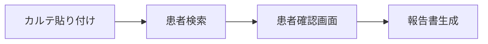
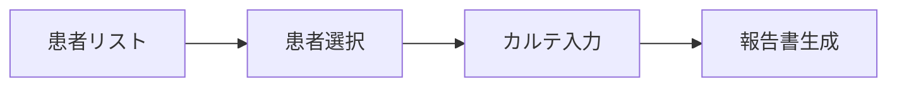

# AI報告書作成機能仕様書 v3.0

## 更新履歴
- v2.4.0: フィルター・ソート機能、作成履歴管理追加
- v3.0.0: **カルテ貼り付けタブ機能、2カラム患者確認画面追加**
- v3.1.0: **UX改善（高速遷移、タブ制御強化）** 🆕
- v4.0.0: **Azure OpenAI APIへの完全移行** 🆕

## 機能概要
診察カルテをコピー＆ペーストすることで、AIが自動的に内容を要約し、居宅療養管理指導報告書を即座に生成する機能。**2つの開始方法**を提供し、様々な業務フローに対応。

## 2つの開始方法（v3.0.0 新機能）

### タブ1: カルテを貼り付けて始める 🆕
電子カルテシステムから診療記録を直接コピー＆ペーストして報告書を作成する、最速のフロー。

#### ワークフロー


#### Step 1: カルテ貼り付け
- 大型テキストエリア（400px高）
- プレースホルダーに入力例を表示
- 10文字以上で「患者を検索」ボタン有効化

#### Step 2: 患者確認（2カラムレイアウト） 🆕
カルテから患者情報（ID/名前）を自動抽出し、DBと照合後、確認画面を表示。

##### 2カラム構造
```
┌─────────────────────┬─────────────────────┐
│     左カラム         │     右カラム         │
│                     │                     │
│   ID: 12345678      │  基本情報           │
│   田中太郎 様        │  ・生年月日         │
│                     │  ・住所             │
│   この患者で        │                     │
│   報告書を作成      │  ケアオフィス情報    │
│   しますか？        │  ・事業所名         │
│                     │  ・ケアマネ         │
│   [✅ 作成] [←戻る] │  ・事業所住所       │
│                     │                     │
│                     │  訪問看護ステーション │
│                     │  ・ステーション名    │
│                     │  ・住所・電話       │
│                     │                     │
│                     │  書類作成履歴        │
│                     │  ・2025-01-15 報告書 │
│                     │  ・2024-12-15 報告書 │
└─────────────────────┴─────────────────────┘
```

##### UI特徴
- **左カラム**: グラデーション背景（#667eea → #764ba2）で視覚的インパクト
- **患者名**: 36px大型フォントで表示
- **確認メッセージ**: 「この患者で報告書を作成しますか？」
- **右カラム**: スクロール可能な詳細情報エリア

#### Step 3: 報告書生成
確認後、既存の報告書生成処理を実行（「患者を選んで始める」と同一）。

### タブ2: 患者を選んで始める
従来の患者リストから選択する方法。AI作成履歴やフィルター機能でより使いやすく。

#### ワークフロー


## 技術仕様（v3.0.0 追加分）

### 患者検索API
```javascript
GET /api/patients/search?patientId=12345678&patientName=田中

Response:
{
    "success": true,
    "patient": {
        "patientid": "12345678",
        "patientname": "田中太郎",
        "birthdate": "1950-01-01",
        "address": "東京都千代田区...",
        "office_name": "ケアプランセンターA",
        "office_address": "東京都...",
        "cm_name": "佐藤花子",
        "vns_name": "訪問看護ステーション",
        "vns_address": "東京都...",
        "vns_tel": "03-1234-5678",
        "recent_reports": [  // 🆕 過去の書類履歴
            {
                "fileId": 123,
                "fileName": "20250115居宅療養管理指導報告書",
                "createdAt": "2025-01-15",
                "category": "居宅",
                "isAIGenerated": true
            }
        ]
    }
}
```

### カルテからの患者情報抽出
```javascript
extractPatientInfoFromKarte(karteContent) {
    // 患者ID抽出パターン（8桁数字）
    const idPatterns = [
        /患者ID[:：]?\s*(\d{8})/i,
        /ID[:：]?\s*(\d{8})/,
        /患者番号[:：]?\s*(\d{8})/
    ];

    // 患者名抽出パターン
    const namePatterns = [
        /患者名[:：]?\s*([^\s\n]+)/,
        /氏名[:：]?\s*([^\s\n]+)/,
        /名前[:：]?\s*([^\s\n]+)/
    ];

    return { patientId, patientName };
}
```

### DB照合処理
1. 患者IDを優先して検索
2. IDがない場合は患者名で部分一致検索
3. 見つからない場合はエラー表示
4. 複数候補がある場合は最初の1件を表示

### CSS実装（2カラムレイアウト）
```css
.confirmation-columns {
    display: grid;
    grid-template-columns: 1fr 1.2fr;
    gap: 30px;
}

.patient-main-confirm {
    background: linear-gradient(135deg, #667eea 0%, #764ba2 100%);
    border-radius: 16px;
    padding: 50px 40px;
    color: white;
    text-align: center;
}

.patient-name-display {
    font-size: 36px;
    font-weight: bold;
    margin-bottom: 30px;
}

/* レスポンシブ対応 */
@media (max-width: 768px) {
    .confirmation-columns {
        grid-template-columns: 1fr;
    }
}
```

## エラーハンドリング（v3.0.0 追加）

### カルテ貼り付けタブ固有のエラー

#### 患者情報抽出失敗
- エラーメッセージ: 「カルテから患者情報を抽出できませんでした」
- 対処: 患者IDまたは患者名がカルテに含まれているか確認

#### 患者が見つからない
- エラーメッセージ: 「該当する患者が見つかりませんでした」
- 対処: 患者IDが正しいか確認、または「患者を選んで始める」タブを使用

#### 複数患者の候補
- 現在の仕様: 最初の1件を表示
- 将来: 選択UIの実装を検討

## データベース拡張（v3.0.0）

### Documentsテーブル
過去の書類作成履歴を表示するため、以下のインデックスを推奨：
```sql
CREATE INDEX idx_documents_patient_ai_created
ON Documents(patientID, is_ai_generated, created_at DESC);
```

## 実装ファイル（v3.1.0 更新）

### フロントエンド
- `frontend/ai_report.html` - タブUI、2カラム確認画面
- `frontend/js/ai_report_page.js` - タブ切替、患者検索、DB照合、**Step2タブ制御**（v3.1.0）🆕
- `frontend/css/ai_report.css` - タブスタイル、2カラムレイアウト
- `frontend/templates/kyotaku_report_template.html` - **自動遷移タイマー1秒に短縮**（v3.1.0）🆕

### バックエンド
- `backend/controllers/patientsController.js` - searchPatient API（書類履歴付き）
- `backend/routes/patients.js` - /searchルート

## 利点と効果

### 業務効率化
- **カルテ貼り付けタブ**: 電子カルテから直接コピペで最速作成
- **患者確認画面**: 間違った患者での作成を防止
- **書類履歴表示**: 重複作成の防止、過去の報告書確認
- **高速画面遷移**: PDF保存後1秒で次の作業へ（v3.1.0）🆕

### ユーザビリティ
- **2つの開始方法**: 状況に応じた柔軟な選択
- **2カラムレイアウト**: 情報の整理と視覚的確認
- **大きな患者名表示**: 誤認防止と確認のしやすさ
- **誤操作防止**: Step2以降でタブを自動非表示（v3.1.0）🆕

### データ整合性
- **DB照合**: カルテの情報とDBの正確な情報を統合
- **deterministic情報**: ケアオフィス、ケアマネ等の確定情報を自動取得
- **履歴管理**: 過去の作成履歴をトラッキング

## UX改善詳細（v3.1.0追加）

### 高速化
- **自動遷移の最適化**: PDF保存成功後、1秒で患者選択画面へ遷移
  - 従来: 2秒待機 → 改善: 1秒待機
  - 連続作業のテンポ向上
  - 視覚的フィードバック後の迅速な画面切り替え

### 誤操作防止
- **インテリジェントタブ制御**: ワークフロー進行に応じたタブ表示制御
  - Step2進入時: タブを自動的に非表示
  - 戻るボタン使用時: タブを再表示
  - 誤クリックによるデータ損失を防止
  - ワークフローの一貫性を保証

### 実装技術
```javascript
// Step2進入時のタブ非表示
showPatientConfirmation(patient) {
    // ...患者情報表示処理...

    // Step2に進んだらタブを非表示にする
    const tabContainer = document.querySelector('.report-tabs');
    if (tabContainer) {
        tabContainer.style.display = 'none';
    }
}

// Step1復帰時のタブ再表示
backToKarteInput() {
    // ...Step1への復帰処理...

    // Step1に戻ったらタブを再表示
    const tabContainer = document.querySelector('.report-tabs');
    if (tabContainer) {
        tabContainer.style.display = 'flex';
    }
}
```

## 今後の拡張予定

### Phase 1（短期）
- 複数患者候補時の選択UI
- カルテ貼り付けの履歴保存
- 患者確認画面のカスタマイズ
- さらなるUX最適化（アニメーション、トランジション）

### Phase 2（中期）
- AIによる患者情報の高度な抽出
- 類似患者の警告機能
- 書類履歴からの再利用機能

### Phase 3（長期）
- 音声入力対応
- モバイル最適化
- 他システムとの連携強化