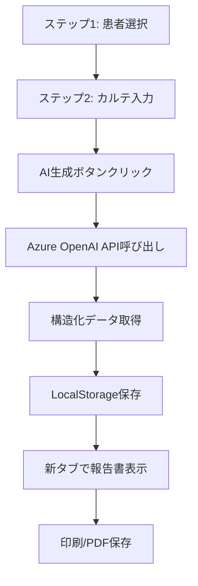

# AI報告書生成機能仕様書 v4.0

## 概要
Azure OpenAI API (gpt-4o-mini)を使用した居宅療養管理指導報告書の自動生成機能。カルテ内容から報告書を自動生成し、PDFとして保存・管理する。

## バージョン情報
- **v4.0.0**: Azure OpenAI API完全移行（2025年9月20日）
- **実装ステータス**: ✅ 本番稼働中

## 主要機能

### 1. 2ステップウィザード形式
**実装ファイル**: `frontend/js/ai_report_page.js`

#### ステップ1: 患者選択
- グリッド形式での患者カード表示
- リアルタイム検索（患者名、ID、ケアマネ名）
- 選択後「次へ」ボタンが有効化

#### ステップ2: カルテ入力・AI生成
- カルテ内容入力（10文字以上必須）
- 「AI生成」ボタンで即座に処理
- LocalStorageに結果を保存
- 新タブで報告書を自動表示

### 2. AI処理仕様

#### Azure OpenAI設定
**実装ファイル**: `backend/services/aiService.js`

```javascript
// 環境変数設定
AI_PROVIDER=azure
AZURE_OPENAI_API_KEY=your_api_key
AZURE_OPENAI_ENDPOINT=https://hyos-mfrzvno2-swedencentral.services.ai.azure.com
AZURE_OPENAI_DEPLOYMENT_NAME=gpt-4o-mini
AZURE_OPENAI_API_VERSION=2024-10-21
```

#### AI抽出項目
- **介護度**: カルテから「要介護」「要支援」を検出
- **主病名**: 診断名、病名を抽出
- **診察日**: カルテ記載日付を抽出
- **次回診察日**: 「次回」「○月後」から推定
- **診療内容要約**: 最大8行でバイタル、検査値、症状を要約
- **生活指導**: 9カテゴリから最重要1つを選択

### 3. データフロー



### 4. API仕様

#### AI報告書生成エンドポイント
```
POST /api/ai/generate-kyotaku-report
Content-Type: application/json

Request:
{
  "patient_id": 99999998,
  "karte_content": "カルテ内容..."
}

Response:
{
  "success": true,
  "data": {
    "care_level": "要介護3",
    "primary_disease": "高血圧症、糖尿病",
    "exam_date": "2025/1/18",
    "next_exam_date": "2025/2/18",
    "medical_content": "診療内容の要約...",
    "selected_advice": "diabetes",
    "advice_text": "生活指導内容..."
  }
}
```

## 技術仕様

### フロントエンド
- **メインファイル**: `frontend/ai_report.html`
- **JavaScript**: `frontend/js/ai_report_page.js`
- **テンプレート**: `frontend/templates/kyotaku_report_template.html`
- **データ受け渡し**: LocalStorage専用設計

### バックエンド
- **AIサービス**: `backend/services/aiService.js`
- **コントローラー**: `backend/controllers/patientsController.js`
- **ルート**: `backend/routes/ai.js`

### 特徴
- **プロバイダー切り替え可能**: OpenAI/Azure OpenAI対応
- **エラーハンドリング**: 詳細なエラーログ出力
- **温度設定**: 0.3（一貫性重視）
- **最大トークン**: 1000

## パフォーマンス要件

- **患者リスト取得**: < 500ms
- **AI報告書生成**: 3-5秒（Azure OpenAI API依存）
- **画面遷移**: < 200ms
- **LocalStorage読み書き**: < 10ms
- **カルテ入力上限**: 5,000文字（APIで自動カット）

## セキュリティ仕様

- **APIキー管理**: 環境変数（.env.local）で管理
- **学習防止**: Azure OpenAIは学習に使用されない
- **データ保護**: 患者情報はサーバー側でのみ処理
- **一時データ**: LocalStorageは印刷後自動クリア

## トラブルシューティング

### Azure OpenAI接続エラー
```bash
# 接続テスト実行
cd backend && node test-azure-openai.js
```

### レポート生成エラー
```bash
# 機能テスト実行
cd backend && node test-report-generation.js
```

### LocalStorage読み込みエラー
- 同一オリジンからのアクセスを確認
- ブラウザの開発者ツールでLocalStorageを確認

## 今後の拡張計画

### 実装済み ✅
- Azure OpenAI API移行（v4.0.0）
- 2ステップフロー簡略化
- LocalStorage専用データ受け渡し
- インライン編集機能

### 計画中
- 複数患者の一括処理
- 音声入力対応
- 画像認識（検査結果の自動取り込み）
- カスタムテンプレート管理

## 変更履歴

| バージョン | 日付 | 内容 |
|-----------|------|------|
| v4.0.0 | 2025-09-20 | Azure OpenAI API完全移行 |
| v3.1.0 | 2025-09-19 | UX高速化（2秒→1秒） |
| v3.0.0 | 2025-09-19 | カルテ貼り付けタブ機能 |
| v2.4.0 | 2025-09-18 | 患者リストフィルター・ソート |
| v2.1.0 | 2025-01-17 | インライン編集機能 |

## 関連ドキュメント
- [システム概要](../../PRD.md)
- [API仕様書](./04-api.md)
- [データベース設計](./03-database.md)